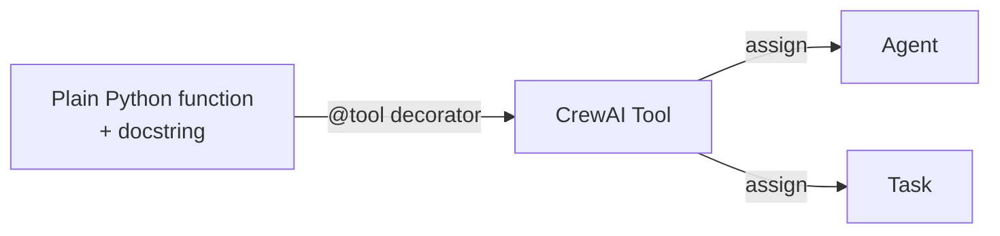
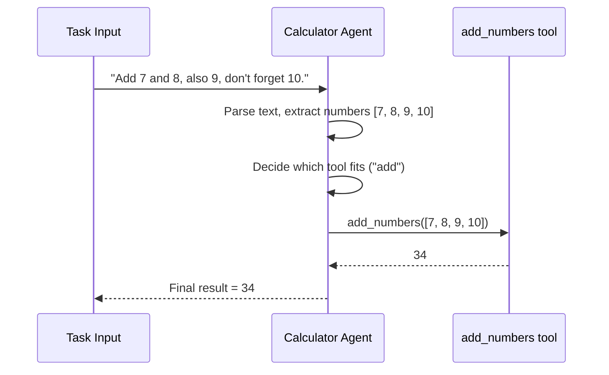
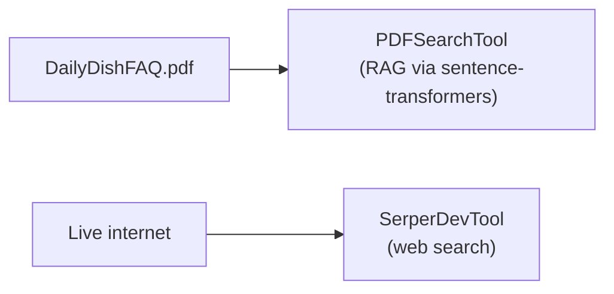
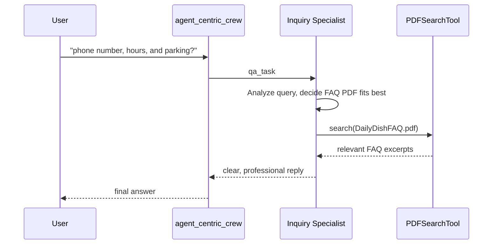
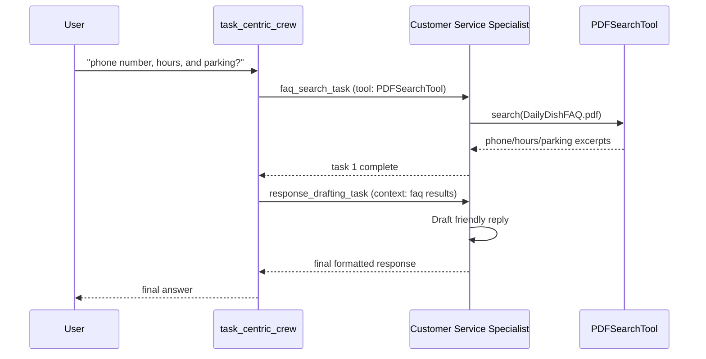
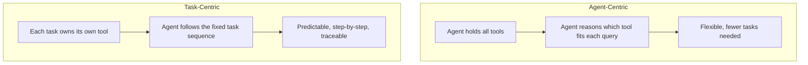

# Extending CrewAI with Custom Functions (Tools)

## What are custom functions/tools?

Built-in tools (web search, PDF search, etc.) cover common cases, but **custom tools** let you register any domain-specific Python function so agents can call it. This gives more flexibility, efficiency, and control over what an agent is capable of doing.

In CrewAI, register a plain function as a tool with the **`@tool`** decorator from `crewai.tools` (CrewAI's equivalent of LangChain's similar decorator).



---

## Example 1: A Calculator agent with custom tools

```python
from crewai.tools import tool
from crewai import Agent, Task, Crew, LLM

llm = LLM(model="watsonx/ibm/granite-13b-instruct-v2")

@tool("add_numbers")
def add_numbers(numbers: list[float]) -> float:
    """Adds a list of numbers together and returns the sum."""
    return sum(numbers)

@tool("multiply_numbers")
def multiply_numbers(numbers: list[float]) -> float:
    """Multiplies a list of numbers together and returns the product."""
    result = 1
    for n in numbers:
        result *= n
    return result

calculator_agent = Agent(
    role="Calculator",
    goal="Extract, add, or multiply numbers from natural language instructions",
    backstory="A precise assistant skilled at interpreting numeric instructions in plain text.",
    tools=[add_numbers, multiply_numbers],
    llm=llm,
)

calc_task = Task(
    description="Add all the numbers mentioned in: 'Add 7 and 8, also 9, don't forget 10.'",
    expected_output="The final numeric result.",
    agent=calculator_agent,
)

crew = Crew(agents=[calculator_agent], tasks=[calc_task])
result = crew.kickoff()
print(result.raw)   # 34
```

### What happens at runtime



The agent itself reasons about **which tool to use** and **what arguments to extract** from the free-text input — the tool is just the deterministic execution step.

---

## Example 2: The Daily Dish Q&A bot — two ways to assign tools

Scenario: answer FAQ-style customer questions (hours, location, parking, etc.) about "The Daily Dish," falling back to a live web search for anything not covered in the FAQ document.

### The two tools

| Tool | Purpose | Notes |
|---|---|---|
| `PDFSearchTool` | RAG-based search over `DailyDishFAQ.pdf` | Uses Hugging Face sentence transformers to retrieve the most relevant chunks |
| `SerperDevTool` | Real-time web search | Requires an API key; used when the FAQ doesn't cover the question |



CrewAI supports two different philosophies for wiring these tools into a workflow: **agent-centric** and **task-centric**.

---

### Approach A: Agent-centric — tools on the agent

The agent itself decides, per query, which tool is appropriate.

```python
from crewai_tools import PDFSearchTool, SerperDevTool

pdf_search_tool = PDFSearchTool(pdf="DailyDishFAQ.pdf")
web_search_tool = SerperDevTool()

inquiry_specialist = Agent(
    role="Inquiry Specialist",
    goal="Answer customer questions about The Daily Dish accurately, using the FAQ PDF or web search as needed",
    backstory=(
        "You have access to both the official FAQ document and real-time web search. "
        "You reason about which source will give the most accurate answer."
    ),
    tools=[pdf_search_tool, web_search_tool],   # <-- tools live on the agent
    llm=llm,
)

qa_task = Task(
    description="Answer the customer's question: {question}. Choose the FAQ PDF or a web search as appropriate.",
    expected_output="A clear, helpful, well-formatted response.",
    agent=inquiry_specialist,
)

agent_centric_crew = Crew(agents=[inquiry_specialist], tasks=[qa_task])
response = agent_centric_crew.kickoff(inputs={"question": "What are your phone number, hours, and parking?"})
```



---

### Approach B: Task-centric — tools on the task

Here, the agent does **not** choose tools independently — each task explicitly owns the tool it needs, guiding the agent through a fixed, multi-step process.

```python
customer_service_specialist = Agent(
    role="Customer Service Specialist",
    goal="Provide support through a guided, multi-step process",
    backstory="Follows a defined process step by step rather than choosing tools independently.",
    llm=llm,
    # note: no tools assigned here
)

faq_search_task = Task(
    description="Search the FAQ for information relevant to: {question}",
    expected_output="Relevant excerpts from the FAQ document.",
    agent=customer_service_specialist,
    tools=[pdf_search_tool],        # <-- tool lives on the task
)

response_drafting_task = Task(
    description="Using the FAQ search results, draft a friendly, clear reply to the customer.",
    expected_output="A friendly, complete customer response.",
    agent=customer_service_specialist,
    context=[faq_search_task],
)

task_centric_crew = Crew(
    agents=[customer_service_specialist],
    tasks=[faq_search_task, response_drafting_task],
    process=Process.sequential,
)

# simple chatbot loop
while True:
    question = input("Ask a question: ")
    response = task_centric_crew.kickoff(inputs={"question": question})
    print(response.raw)
```



---

## Agent-centric vs. Task-centric



| | Agent-centric | Task-centric |
|---|---|---|
| Where tools live | On the `Agent` | On individual `Task`s |
| Who decides which tool to use | The agent, dynamically, per query | Predetermined by which task runs |
| Best for | Open-ended questions, varied query types | Fixed, multi-step processes needing traceability |
| Flexibility | Higher — agent adapts per input | Lower — but more predictable/debuggable |

---

## Summary

- **Custom tools** are registered with the `@tool` decorator on any Python function (with a docstring describing its purpose), letting agents call domain-specific logic (e.g., `add_numbers`, `multiply_numbers`).
- An agent equipped with tools **parses input, extracts relevant data, and decides which tool to invoke** to produce a result.
- Tools can be attached in two different ways:
  - **Agent-centric**: tools live on the `Agent`; the agent itself chooses the right tool per query (e.g., FAQ PDF vs. web search).
  - **Task-centric**: tools live on individual `Task`s; the workflow is a fixed, guided sequence, and the agent just follows it — better for traceability and step-by-step processes.
- Real-world example: a "Daily Dish" Q&A bot uses `PDFSearchTool` (RAG over an FAQ PDF via Hugging Face sentence transformers) and `SerperDevTool` (real-time web search) to answer customer questions, demonstrated both ways.
