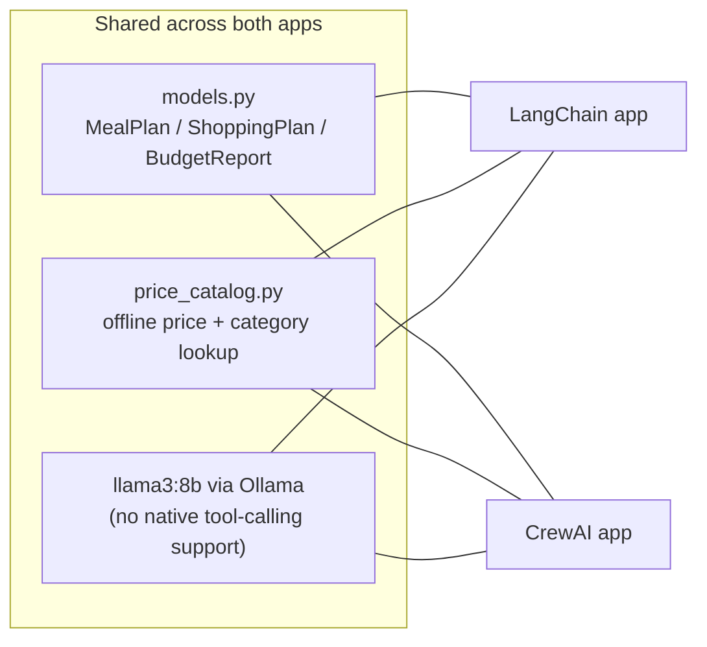
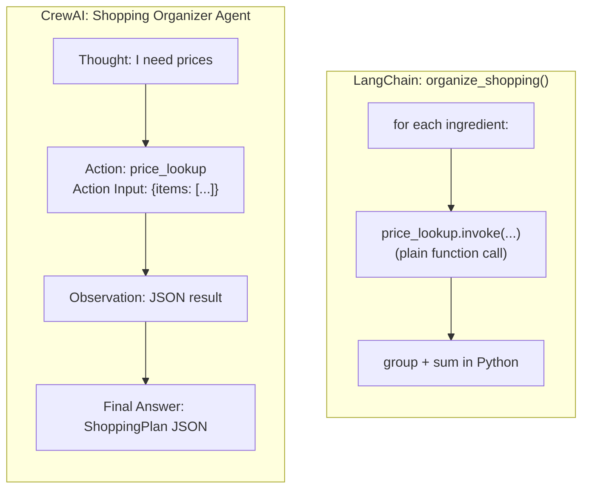
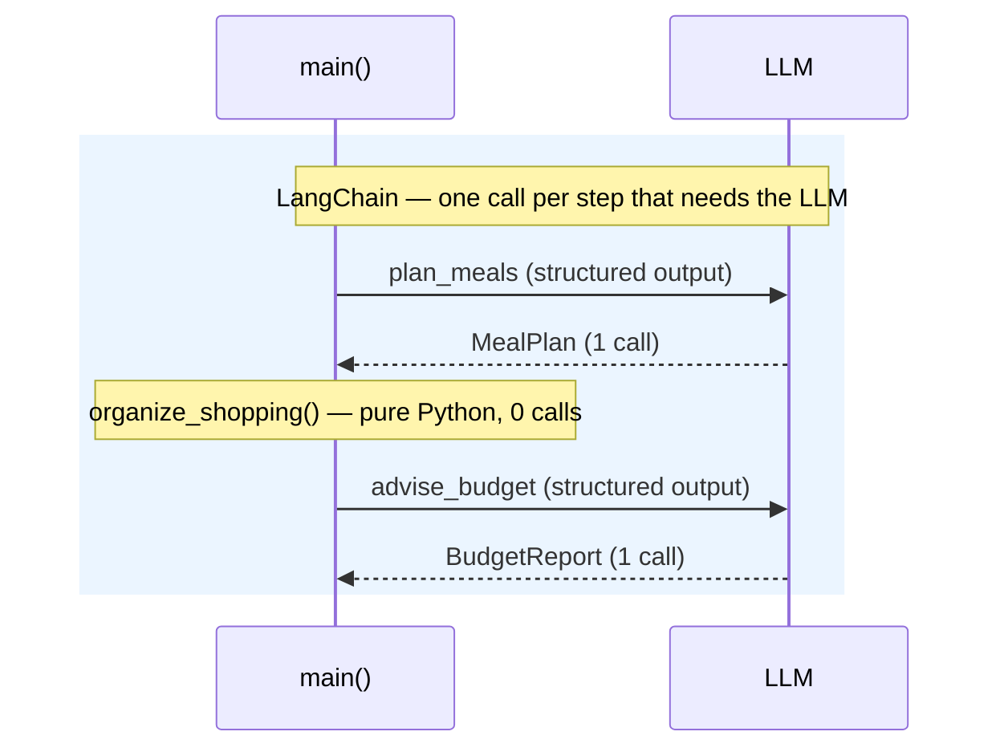
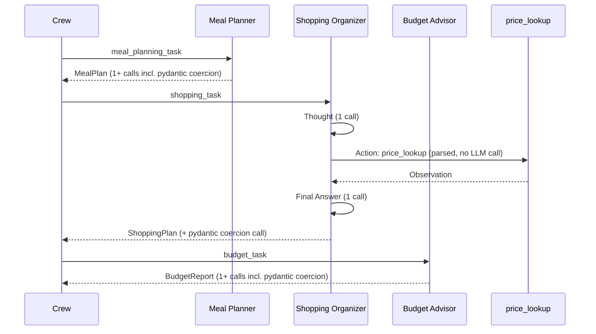

# Meal Planner: LangChain vs. CrewAI — a hands-on comparison

Both apps solve the exact same problem, with the exact same Pydantic
schema and the exact same local LLM:

- [../langchain/meal-planner-agent](../langchain/meal-planner-agent) — plain LangChain (LCEL)
- [../crew-ai/meal-planner-agent](meal-planner-agent) — CrewAI

**Problem statement:** planning meals, staying on budget, and building a
grocery list by hand takes hours — browsing recipes, calculating
quantities, checking prices, organizing a shopping list, hoping it all
fits your diet and budget. Both apps automate this with 3 steps: plan
meals → price & organize the shopping list → check the budget and suggest
savings.

Both run against the **same local Ollama model** (`llama3:8b`, no API
key, nothing leaves your machine), the same setup as
[../rag-with-langchain/simple-rag-example-chromadb](../rag-with-langchain/simple-rag-example-chromadb).
Everything below is observed from actually running both apps, not just
theory.



---

## 1. The constraint that shaped both designs: no native tool-calling

Before writing either app, we tested whether `llama3:8b` (as served by
Ollama) supports native function-calling:

```python
llm_with_tools = ChatOllama(model="llama3:8b").bind_tools([some_tool])
llm_with_tools.invoke("...")
# ollama._types.ResponseError: registry.ollama.ai/library/llama3:8b does not support tools (400)
```

It doesn't. `ollama list`'s API confirms it: the model's `capabilities`
are `["completion"]` only — no `"tools"`. This single fact is the reason
the two apps end up structured so differently:

| | Requires native tool-calling? | What happens with `llama3:8b` |
|---|---|---|
| LangChain's modern `create_agent` / `.bind_tools()` | Yes | Fails outright (`400: does not support tools`) |
| CrewAI's `Agent` + `tools=[...]` | No (has its own fallback) | Works — falls back to its own ReAct-style ("Thought/Action/Action Input") text prompting when native function-calling fails |

This is a real, load-bearing framework difference, not a style choice:
**CrewAI ships its own text-based tool-calling loop that works with any
completion model; LangChain's current agent API assumes the model
supports OpenAI-style function calling.** (Older LangChain versions had a
text-based `create_react_agent`/`AgentExecutor` too, but that path is
legacy in LangChain 1.x's unified `create_agent`.)

That's why:

- The **LangChain app** calls its pricing "tool" (`price_lookup`)
  **directly in Python**, deterministically, for every ingredient — no
  LLM decides to call it, because there's no reliable LLM-driven path to
  do so with this model.
- The **CrewAI app** gives its Shopping Organizer *agent* the tool, and
  the agent genuinely decides to call it (visible in the verbose
  trace as `Thought → Action: price_lookup → Action Input: {...} →
  Observation`). It required one extra thing to make reliable: an
  **explicit example of the tool's JSON arguments in the task
  description** — an 8B model isn't good at inferring a new tool's
  argument shape unprompted, but it copies a shown example well.



---

## 2. Orchestration: function calls vs. Agent/Task/Crew

| | LangChain (this app) | CrewAI (this app) |
|---|---|---|
| Unit of work | A Python function per step | An `Agent` + `Task` pair per step |
| Data passed between steps | Ordinary Python objects (`MealPlan`, `ShoppingPlan`) | `context=[previous_task, ...]` — CrewAI serializes the prior task's output into the next task's prompt automatically |
| Deciding *whether* a step needs the LLM | You decide — step 2 (`organize_shopping`) is pure code, no LLM call at all | Every task runs through an agent; there's no "plain code task" — even a purely mechanical step goes through an LLM |
| Running the pipeline | Call three functions in sequence in `main()` | Build one `Crew(agents=[...], tasks=[...], process=Process.sequential)` and call `.kickoff()` once |
| Structured output | `llm.with_structured_output(Model)` per call | `output_pydantic=Model` on the `Task` |

This is the clearest architectural takeaway: **LangChain (LCEL) makes you
assemble the pipeline yourself, which means you can freely mix "LLM step"
and "plain code step."** CrewAI's abstraction is convenient (an
agent/task/crew maps naturally onto "who does what, in what order"), but
because everything is framed as an agent completing a task, even
deterministic work tends to get routed through an LLM call.

That's exactly why this repo's CrewAI version pushed **all the pricing
arithmetic into the `price_lookup` tool itself** (plain Python, inside
`tools.py`), rather than trusting the Shopping Organizer agent to sum
category subtotals — an 8B model doing multi-item arithmetic in its head
is unreliable, and unlike the LangChain version, there's no "just write a
function" escape hatch mid-task in CrewAI's model (the escape hatch has
to be *inside* a tool, or done in Python *after* `.kickoff()` returns, as
the CrewAI app also does when it re-derives `BudgetReport.total_cost`
from Python instead of trusting the LLM's copy of the number).

---

## 3. Measured cost: LLM calls & tokens for the identical task

Both apps were run with identical inputs (`budget=$40`, `diet=vegetarian`,
`num_meals=2`) against the same local `llama3:8b`:

| | LLM calls | Total tokens |
|---|---|---|
| **LangChain** | 2 (`plan_meals`, `advise_budget` — `organize_shopping` makes none) | 714 |
| **CrewAI** | 12 (`result.token_usage.successful_requests`) | 21,675 |

That's roughly **6x the LLM calls and ~30x the tokens** for the same
task and the same model. Why the gap is that large:





Every CrewAI task can involve multiple round trips: a reasoning/thought
pass, the tool-call parsing loop, a "Final Answer" pass, and — because
the underlying model can't natively return typed JSON via function
calling — an extra pass to coerce free text into the `output_pydantic`
schema. LangChain's `with_structured_output` does this in a single call
via Ollama's constrained JSON-schema decoding (`format=<schema>`), which
doesn't need a native tool-calling model at all.

**Takeaway:** CrewAI's agent abstraction is doing more *for* you (role
framing, automatic context threading, a built-in tool-calling fallback
that works even on non-tool-calling models) — but each of those
conveniences is implemented as extra LLM round trips, which is real
latency and token cost, especially against a local model with no
per-token cost pressure to hide it.

---

## 4. Code shape, side by side

**LangChain — step 2 is just a function:**

```python
def organize_shopping(meal_plan: MealPlan) -> ShoppingPlan:
    grouped: dict[str, list[PricedItem]] = defaultdict(list)
    for meal in meal_plan.meals:
        for ingredient in meal.ingredients:
            price_str, category = price_lookup.invoke({"item": ingredient.name}).split("|")
            grouped[category].append(PricedItem(...))
    ...
    return ShoppingPlan(categories=categories, total_cost=total_cost)
```

**CrewAI — step 2 is an agent with a tool and a task description:**

```python
shopping_organizer = Agent(
    role="Shopping Organizer",
    tools=[price_lookup],
    llm=llm,
)
shopping_task = Task(
    description="...call price_lookup EXACTLY ONCE with the full list...",
    agent=shopping_organizer,
    context=[meal_planning_task],
    output_pydantic=ShoppingPlan,
)
```

Neither is "more correct" — they reflect different bets. LangChain bets
that *you* know which steps need an LLM and which don't, and gives you
raw composability to express that. CrewAI bets that framing everything as
agents/tasks/crew keeps a multi-agent system legible and consistent, at
the cost of an LLM call for steps that didn't strictly need one.

---

## 5. When to reach for which (for this kind of task)

| Reach for **LangChain (LCEL)** when... | Reach for **CrewAI** when... |
|---|---|
| You want full control over exactly when the LLM is called vs. plain code | You want role-based agents that read naturally as a "team" doing the work |
| Token/latency cost matters and some steps are purely deterministic | Rapid prototyping of a multi-agent workflow matters more than call-count efficiency |
| Your model doesn't support native tool-calling and you're fine writing the orchestration yourself | You need agentic tool use (the LLM *deciding* whether/what to call) even on a model without native function-calling |
| The pipeline is a fixed, known sequence | You want built-in `context=[...]` wiring and structured per-task outputs (`tasks_output`, `token_usage`) out of the box |

## 6. See also

- [../langchain/meal-planner-agent/README.md](../langchain/meal-planner-agent/README.md)
- [../crew-ai/meal-planner-agent/README.md](meal-planner-agent/README.md)
- [cew-ai-vs-others.md](cew-ai-vs-others.md) — the earlier, more general CrewAI-vs-LangChain-vs-LlamaIndex writeup this hands-on comparison confirms empirically
