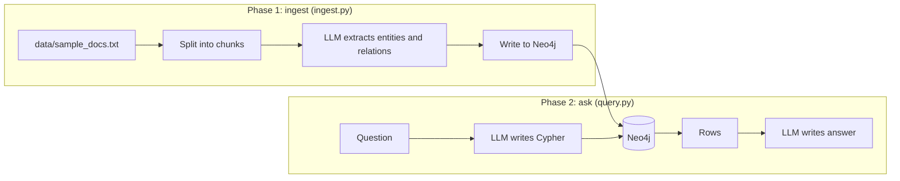

# Step 0 — Overview and Concepts

> [Back to index](README.md) · Next: [Environment Setup](02-environment-setup.md)

## Goal

Understand what a knowledge graph is, what Cypher is, and why this app is built as two separate phases, before typing any code.

## Why this matters

Traditional RAG embeds text chunks and returns the ones most similar to the question. That works when the answer sits inside one passage. It fails when the answer is spread across facts in different passages and the link between them is a *relationship*, not a similar word. "Is Acme Ltd exposed to sanctions risk?" needs three sentences that never mention each other: Acme is owned by Zenith, Zenith is controlled by Bob, Bob is on a sanctions list. Vector search for "Acme sanctions" retrieves the first sentence at best.

A knowledge graph fixes this by storing those facts as **nodes** (entities) joined by **typed, directed edges** (relationships), so a question becomes a path traversal instead of a similarity guess. The cost is that you have to *build* the graph first, and that build step is where an LLM earns its keep: reading messy prose and emitting clean entities and relations.

That cost is why the app has two phases. Building the graph is slow, costs LLM calls, and only needs to happen when documents change. Asking questions is fast and happens constantly. Keeping them as two commands, `ingest` and `ask`, mirrors that split and means you never pay extraction cost to answer a question.

## 1. The vocabulary

| Term | Meaning | Example in this app |
| --- | --- | --- |
| Node | An entity | `(:Company {id: "Acme Ltd"})` |
| Label | The type of a node | `Company`, `Person`, `SanctionList` |
| Relationship | A typed, directed edge between two nodes | `(Acme)-[:OWNED_BY]->(Zenith)` |
| Property | A key-value pair on a node or edge | `percentage: 60` |
| Cypher | Neo4j's query language | `MATCH (c:Company)-[:OWNED_BY]->(o) RETURN c, o` |
| Schema | The allowed labels and relationship types | `ALLOWED_NODES`, `ALLOWED_RELATIONSHIPS` in `ingest.py` |

Cypher reads like ASCII art: parentheses are nodes, square brackets are relationships, and the arrow shows direction. `MATCH (c:Company)-[:OWNED_BY]->(o) RETURN c, o` means "find every company, follow an `OWNED_BY` edge out of it, and return both ends."

## 2. The two phases

The LLM appears twice in the app, doing two different jobs. In phase 1 it is an **extractor** (text in, structured graph out). In phase 2 it is a **translator** (English in, Cypher out) and then a **narrator** (rows in, English out). Neo4j itself does the actual reasoning over relationships.

## 3. What you will build, file by file

| Step | File | Responsibility |
| --- | --- | --- |
| 1 | setup files | Neo4j container, `.env`, sample data |
| 2 | `config.py` | Single place that builds the LLM and the graph connection |
| 3-4 | `ingest.py` | Phase 1 |
| 5 | `query.py` | Phase 2 |
| 6 | `main.py` | CLI that calls either phase |

For the design rationale in diagram form, see [../notes/WORKFLOW.md](../notes/WORKFLOW.md). The `Step 1:` and `Step 2:` labels in the docstrings of `ingest.py` and `query.py` refer to the two phases in that file, not to the step numbers in this walkthrough.

## Checkpoint

Nothing to type in this step. Before moving on, make sure you can explain in one sentence each: what a node is, what a relationship is, and why the app has two commands instead of one.

## Common mistakes

| Symptom | Cause | Fix |
| --- | --- | --- |
| "Why not just put the whole text in the prompt?" | Works for five paragraphs, breaks at thousands of documents | Graphs let Neo4j do the traversal, so the prompt only carries the relevant rows |
| Confusing a label with a relationship type | Both are uppercase-ish identifiers in Cypher | Labels go after a colon inside parentheses `(:Company)`; relationship types go inside brackets `[:OWNED_BY]` |
| Expecting `ask` to work before `ingest` | The graph is empty until ingest runs | Always run `ingest` once first |

Next: **[Environment Setup](02-environment-setup.md)**.
