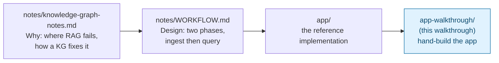

# Knowledge Graph with Neo4j and LangChain — Trainer Walkthrough

> A step-by-step build guide for [../app](../app/README.md). Follow it live in a workshop, or work through it solo — by the end you will have hand-built a small two-phase app that turns plain text into a Neo4j knowledge graph and then answers questions by letting an LLM query that graph.

## What you'll build

A uv project with four Python files and one Docker Compose file:

| File | Role |
| --- | --- |
| `config.py` | Builds the OpenAI chat model and the Neo4j connection from environment variables |
| `ingest.py` | Text to chunks to LLM-extracted entities and relations to Neo4j |
| `query.py` | Question to LLM-written Cypher to Neo4j to LLM-written answer |
| `main.py` | A small CLI with two subcommands: `ingest` and `ask` |

The sample data is five short paragraphs about companies, owners, a sanctioned person, and a loan. The headline question the finished app answers is one a plain vector-search RAG pipeline cannot: *"Is Acme Ltd exposed to sanctions risk?"* — a three-hop path across facts that live in different sentences.

## Who this is for

- **Instructors** demonstrating why a knowledge graph answers multi-hop questions that top-k chunk retrieval misses, and what the build pipeline for one actually looks like.
- **Trainees** typing each file themselves rather than reading finished files top to bottom.

## Prerequisites

- Comfortable with basic Python: functions, tuples, lists, `argparse` at a glance.
- [`uv`](https://docs.astral.sh/uv/) installed.
- [Docker](https://www.docker.com/) installed and running (Neo4j runs as a container).
- An OpenAI API key with access to `gpt-4o` (or whichever model you set in `LLM_MODEL`).
- No prior experience with Neo4j or Cypher assumed. For the concepts behind *why* a knowledge graph beats plain RAG in specific scenarios, [../notes/knowledge-graph-notes.md](../notes/knowledge-graph-notes.md) covers them with diagrams; this walkthrough explains what's needed inline as you build.
- About 80 minutes end to end.

| Step | File | What you'll add | Est. time |
| --- | --- | --- | --- |
| 0 | [01-overview-and-concepts.md](01-overview-and-concepts.md) | Mental model: nodes, edges, Cypher, and the two-phase shape of the app | 10 min |
| 1 | [02-environment-setup.md](02-environment-setup.md) | uv project, Neo4j container, `.env`, sample data | 10 min |
| 2 | [03-connections-config.md](03-connections-config.md) | `config.py` — the LLM and the graph connection | 10 min |
| 3 | [04-ingest-chunking-and-schema.md](04-ingest-chunking-and-schema.md) | `ingest.py` part 1 — load, chunk, and declare the allowed schema | 10 min |
| 4 | [05-ingest-extraction-and-write.md](05-ingest-extraction-and-write.md) | `ingest.py` part 2 — LLM extraction and writing to Neo4j | 15 min |
| 5 | [06-query-cypher-chain.md](06-query-cypher-chain.md) | `query.py` — `GraphCypherQAChain`, a Cypher prompt for multi-hop paths, an answer prompt, auditable intermediate steps | 15 min |
| 6 | [07-cli-entry-point.md](07-cli-entry-point.md) | `main.py` — the `ingest` and `ask` subcommands | 5 min |
| 7 | [08-recap-and-exercises.md](08-recap-and-exercises.md) | Quick-reference card, gotchas, exercises | 10 min |

## Relationship to the reference implementation

Each file's final checkpoint matches its counterpart in [../app/](../app/) exactly: Step 2 → `config.py`, Step 4 → `ingest.py`, Step 5 → `query.py`, Step 6 → `main.py`. The setup files (`docker-compose.yml`, `.env`, `data/sample_docs.txt`) in Step 1 match the reference too. This walkthrough's verification pass confirmed every Python checkpoint is byte-identical to its source file and compiles cleanly, and the finished app was run end to end against a live Neo4j and `gpt-4o`: ingest produced the 8 nodes and 7 relationships described in Step 4, and all four demo questions in Step 6 returned correct answers.

## Suggested demo flow (for instructors)

- Before Step 1, open [../notes/knowledge-graph-notes.md](../notes/knowledge-graph-notes.md) at the "multi-hop" section and write the three source sentences on a whiteboard. Ask the room what a top-k vector search for "Acme sanctions" would return. Everyone gets the answer wrong in the same way, which sets up the whole walkthrough.
- After Step 4 ingests, switch to the Neo4j Browser at `http://localhost:7474` and run `MATCH (n)-[r]->(m) RETURN n, r, m`. Let the group read the graph by eye and find the Acme to Zenith to Bob to OFAC path before you ask the app about it.
- In Step 3, point out that the sample file fits in a single chunk. The chunker is doing nothing visible here; ask what would change with 10,000 documents.
- In Step 4, run ingest twice without `--reset` and show that node counts in Neo4j do not double, then run it with `--reset`. The merge-on-name behaviour is the first thing people get wrong about graph ingestion.
- In Step 5, run the sanctions question with only the default chain first. It answers "I don't know" with `Context: []`. Read the one-hop Cypher aloud, then add `CYPHER_PROMPT` and watch the same question succeed. That before and after is the whole lesson on how LLM-written queries get steered, and the printed `Cypher :` line is the main argument for graphs over opaque embeddings.

## Where this fits

Start here: **[01-overview-and-concepts.md](01-overview-and-concepts.md)**.
