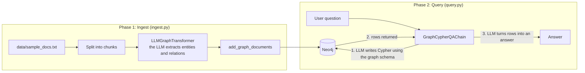
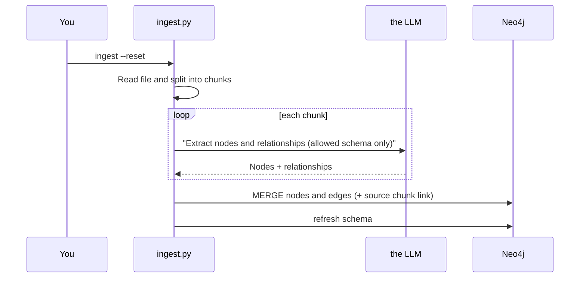
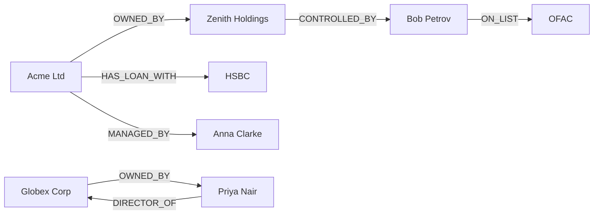
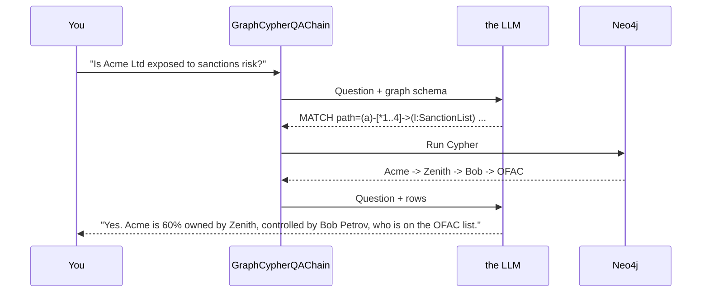

# How the app works

A two-phase app: **build the graph once** (ingest), then **ask questions** (query).

## Overview

## Step by step

### Step 0: Setup
1. Start Neo4j: `docker compose up -d` (browser UI at http://localhost:7474, login `neo4j` / `password123`).
2. Put your key in `.env` (`OPENAI_API_KEY`; model via `LLM_MODEL`, default `gpt-4o`).
3. Install deps: `uv sync`.

### Step 1: Ingest (text to graph)
Run `uv run main.py ingest --reset`.

1. **Load** the raw text.
2. **Chunk** it (500 chars) so the LLM extracts accurately.
3. **Extract**: `LLMGraphTransformer` asks the LLM for entities and relations, restricted to `ALLOWED_NODES` and `ALLOWED_RELATIONSHIPS`. A fixed schema keeps the graph clean.
4. **Write** with `add_graph_documents`. Same-named entities are merged into one node, so "Zenith Holdings" mentioned in two chunks becomes a single node. `include_source=True` links each node to its source chunk for provenance.

Resulting graph:

### Step 2: Query (question to answer)
Run `uv run main.py ask "Is Acme Ltd exposed to sanctions risk?"`.

1. The chain sends the **question + schema** to the LLM, which writes **Cypher**.
2. Neo4j executes it and returns rows or paths (the multi-hop result plain RAG can't produce).
3. the LLM phrases the final answer from those rows. The Cypher and context are printed, so the answer is auditable.

### Step 3: Inspect (optional)
In the Neo4j Browser run `MATCH (n)-[r]->(m) RETURN n, r, m` to see the graph.

## Try these questions
| Question | Shows |
|---|---|
| Is Acme Ltd exposed to sanctions risk? | multi-hop |
| Who manages Acme Ltd? | simple lookup |
| Who are the directors of Globex Corp? | direction/type |
| How many companies are owned by a sanctioned person? | aggregation |

## Next steps (not built yet)
- Add a vector index on chunks and combine with graph (hybrid GraphRAG).
- Entity resolution for aliases (AAPL vs Apple Inc.).
- Temporal edges (`from` / `to`).
- Read-only Neo4j user for the query chain.
