# Knowledge Graphs vs Traditional RAG

## 1. What is a Knowledge Graph?

A knowledge graph (KG) stores facts as **entities (nodes)** connected by **typed, directed relationships (edges)**.

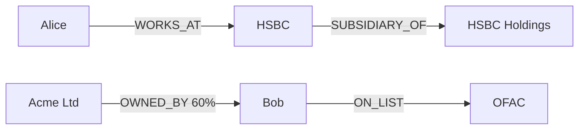

**Traditional RAG** chops documents into chunks, embeds them, and retrieves the top-k chunks that are *semantically similar* to the question.
**A KG** keeps explicit structure, so retrieval can *traverse relationships*.

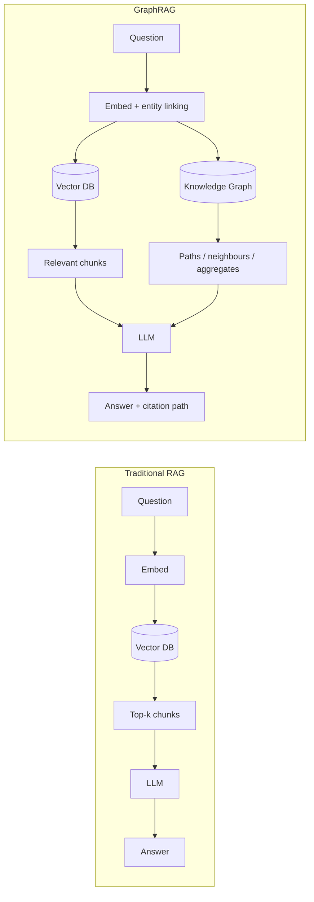

---

## 2. Scenarios where RAG fails and how a KG fixes them

### 2.1 Multi-hop questions

**Question:** *"Is Acme Ltd exposed to sanctions risk?"*

Facts are spread over three documents:

- Doc A: "Acme Ltd is owned 60% by Zenith Holdings."
- Doc B: "Zenith Holdings is controlled by Bob Petrov."
- Doc C: "Bob Petrov was added to the OFAC list in 2024."

No single chunk holds the answer. Vector search for "Acme sanctions" returns Doc A at best, so the LLM says "no evidence."

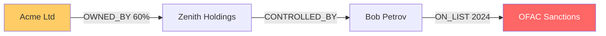

**KG fix:** one traversal finds the path, and each hop is auditable.

```cypher
MATCH p = (c:Company {name:'Acme Ltd'})-[:OWNED_BY|CONTROLLED_BY*1..4]->(x)-[:ON_LIST]->(l:SanctionList)
RETURN p
```

---

### 2.2 Aggregation and counting

**Question:** *"How many clients have a director who also sits on a competitor's board?"*

- RAG sees only top-k chunks, so the LLM guesses.
- A KG gives an exact answer over the whole dataset.

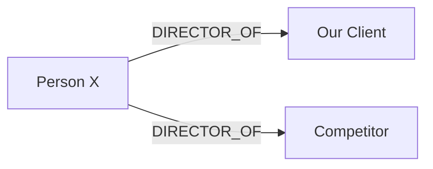

```cypher
MATCH (c:Client)<-[:DIRECTOR_OF]-(p)-[:DIRECTOR_OF]->(:Competitor)
RETURN count(DISTINCT c)
```

---

### 2.3 Global "big picture" questions

**Question:** *"What are the main themes across 10,000 incident reports?"*

Top-k chunks see only a sliver of the corpus. **GraphRAG** extracts entities, detects communities, and pre-summarises each one.

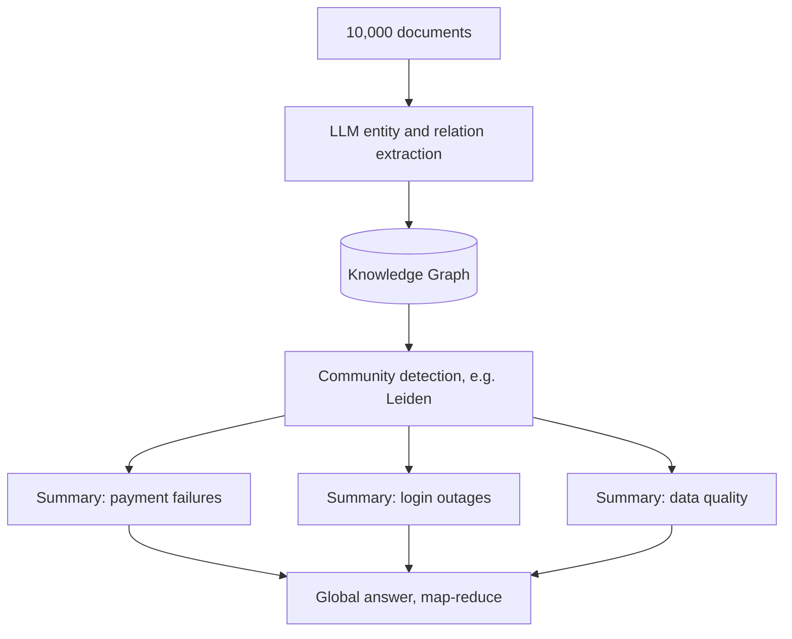

---

### 2.4 Entity disambiguation and aliases

**Question:** *"What loans does Apple have with us?"*

Chunks mention "Apple Inc.", "AAPL", "Apple Computer" and "Apple Bank". Embeddings treat them as similar, so results get mixed.

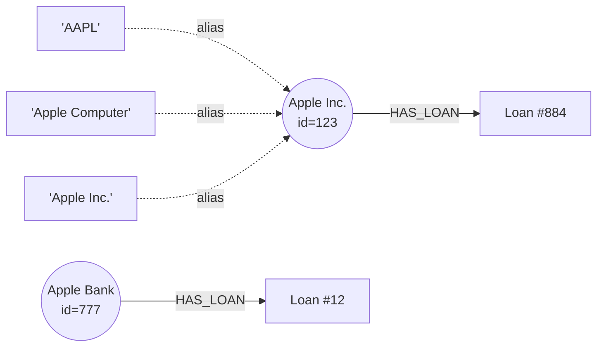

**KG fix:** entity linking resolves each mention to one canonical node, then you follow edges from that node only.

---

### 2.5 Relationship direction and type

*"Who reports to Sarah?"* and *"Who does Sarah report to?"* embed almost identically, so RAG can flip the answer.

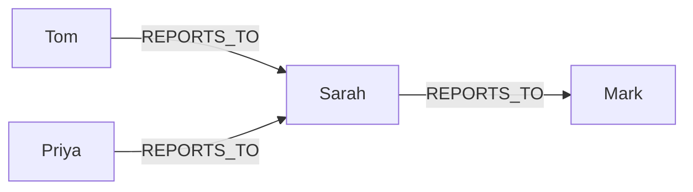

- Who reports to Sarah → `(x)-[:REPORTS_TO]->(Sarah)` → Tom, Priya
- Who does Sarah report to → `(Sarah)-[:REPORTS_TO]->(x)` → Mark

---

### 2.6 Time-aware facts

**Question:** *"Who was Client X's relationship manager in March 2023?"*

Old and new documents are equally similar, so RAG may return the current manager.

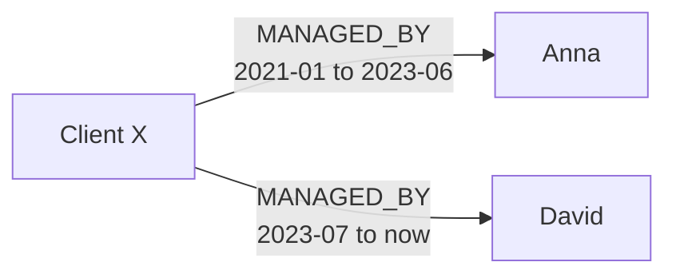

**KG fix:** edges carry validity periods. Filter by date and you get Anna.

---

### 2.7 Explainability and compliance

| | RAG | KG |
|---|---|---|
| Evidence | "Based on these chunks" | Exact node and edge path |
| Provenance | Chunk ID | Every edge links to a source doc |
| Audit | Hard | Straightforward |

---

### 2.8 Fraud and hidden patterns

A fraud ring exists only in the connections, not in any one document.

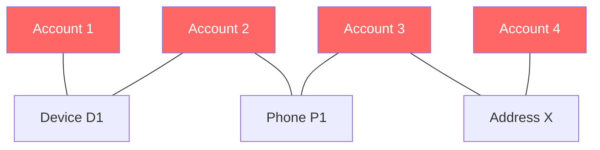

Four "unrelated" accounts are linked through shared devices, phones, and addresses. Connected components and centrality algorithms reveal the ring directly.

---

## 3. Side-by-side summary

| Scenario | Traditional RAG | Knowledge Graph |
|---|---|---|
| Multi-hop reasoning | Misses links across docs | Traverses edges |
| Counting / aggregation | Guesses from top-k | Exact query |
| Global summarisation | Sees a few chunks | Community summaries |
| Ambiguous names | Conflates entities | Canonical entities |
| Direction / relation type | Blurry | Typed, directed edges |
| Time-based facts | Mixes versions | Temporal edges |
| Auditability | Weak | Full path and provenance |
| Hidden patterns | Invisible | Graph algorithms |

---

## 4. Trade-offs

- **Build cost:** entity and relation extraction (usually LLM-driven), schema design, entity resolution. It is noisy and expensive.
- **Maintenance:** the graph must be updated as documents change.
- **Overkill for simple lookups:** "What is our leave policy?" is a single-chunk question that RAG handles fine.

## 5. Recommended approach: Hybrid GraphRAG

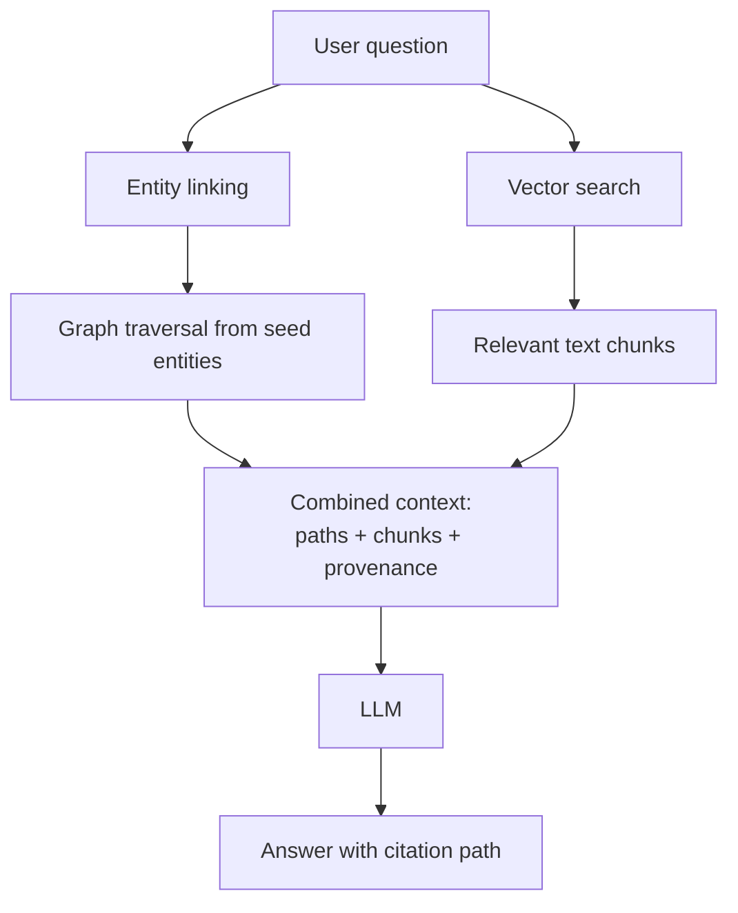

1. **Vector search** finds relevant chunks and seed entities (fuzzy, semantic matching).
2. **Graph traversal** expands to neighbours and multi-hop paths (structure and reasoning).
3. The **LLM** answers from the combined context and cites the path.

### Decision guide

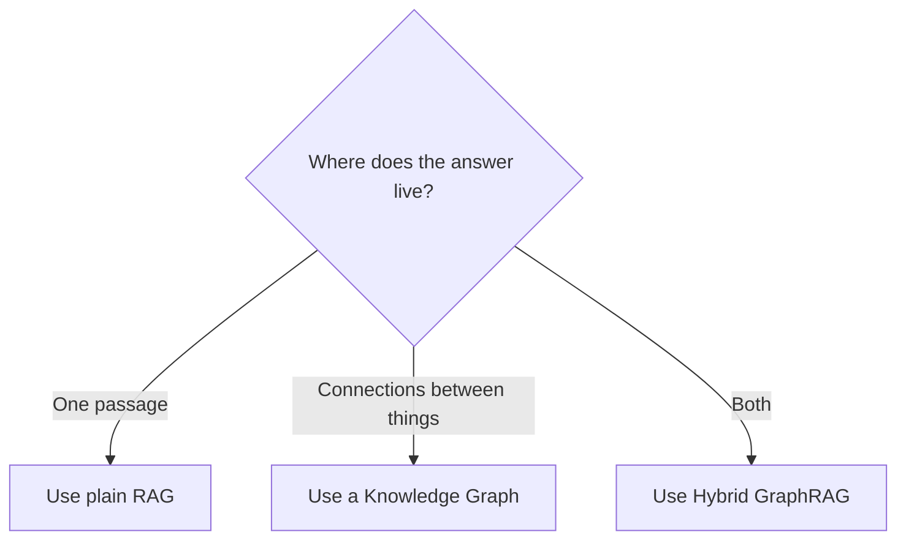

**Rule of thumb:** if the answer lives in **one passage**, use RAG. If it lives in **the connections between things**, use a knowledge graph.
