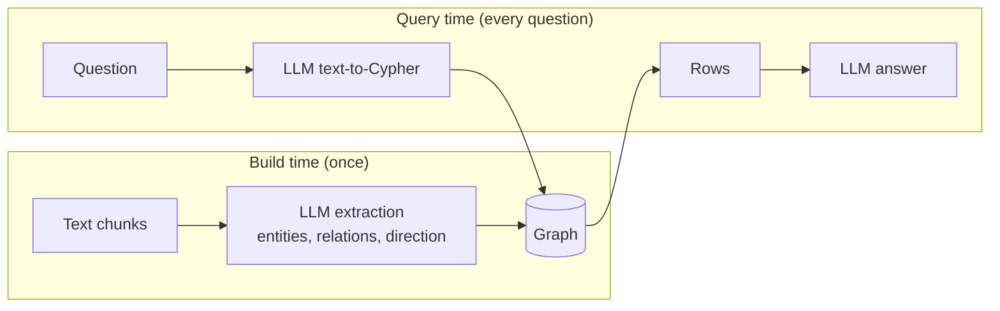
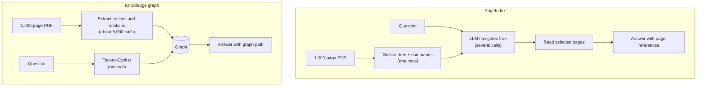
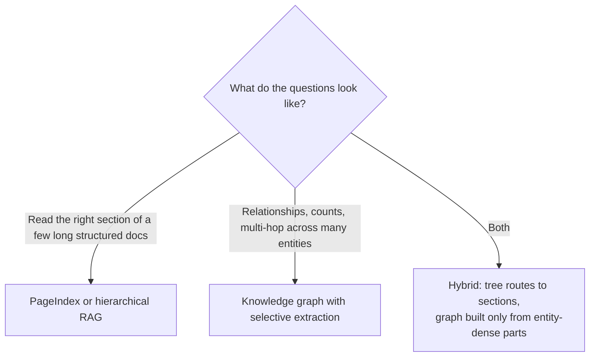

# Knowledge Graphs: LLM Requirements and Scaling to Large Documents

Two questions that come up after the first working demo:

1. Why does knowledge-graph retrieval need a powerful LLM?
2. What happens with very large documents (for example 1,000 pages of PDFs), and how does it compare with PageIndex?

Background: [knowledge-graph-notes.md](knowledge-graph-notes.md), [WORKFLOW.md](WORKFLOW.md), and the measured comparison with plain RAG in [rag-vs-graph-long-docs.md](rag-vs-graph-long-docs.md). For PageIndex itself see [../../vectorless-rag/pageindex-notes.md](../../vectorless-rag/pageindex-notes.md).

---

## Part 1: Why a graph pipeline needs a strong LLM

The LLM does two hard jobs, and mistakes in either one are silent.

### Job 1: extraction (text to graph)

The model must find every entity, resolve pronouns and short names to the right node, choose the right relationship type from the schema, get the direction right, and not drop facts when a chunk holds many.

| Observed with the sample data | Result |
| --- | --- |
| `gpt-4o-mini`, one chunk | 5 of 7 relationships; dropped `Zenith CONTROLLED_BY Bob` and `Globex OWNED_BY Priya`; reversed `Zenith OWNED_BY Acme` |
| `gpt-4o`, same code and data | All 7 correct |

Why it matters more than in plain RAG: a vector index tolerates a bad chunk because the original text is still there. A graph contains only what was extracted. A missing edge is a fact that no longer exists, and a reversed edge states the opposite. A path like Acme to Zenith to Bob to OFAC needs every link, so one error breaks the whole answer.

### Job 2: text-to-Cypher (question to query)

The model must use only labels and relationship types that exist, follow chains with variable-length paths (`*1..4`), and get direction and property names right.

- The default prompt wrote a one-hop query, returned `[]`, and answered "I don't know".
- A custom prompt with a multi-hop example fixed it.
- Bare result rows were not tied back to the question until the prompt asked for aliased columns.

A wrong query does not raise an error. It returns zero or wrong rows, and the answer step turns that into a fluent but wrong sentence.

### Why smaller models struggle more

- Extraction needs consistent structured output across many chunks. Small models drift, skip items and invent relation names.
- Text-to-Cypher is strict code generation against a schema. Small models hallucinate labels and mishandle multi-hop patterns.
- Native tool calling and JSON output follow schemas more reliably in larger models. `llama3:8b` has no native tool calling in Ollama, so extraction relies on fragile parsed text.

### What reduces the dependency

| Technique | Effect |
| --- | --- |
| Strong model for extraction only | Runs once per document set; cheaper model can serve queries |
| Few-shot Cypher examples, direction rules, fixed schema | Fixed the multi-hop failure in this project |
| Validate extracted edges against the schema | Rejects invented or illegal relations |
| Validate Cypher against the schema, retry on empty results | Catches silent failures |
| Fixed query templates for common questions | Model only fills in an entity name |
| Entity resolution after extraction | Merges aliases and spelling variants |
| Fine-tuned extraction or text-to-Cypher models | Smaller model, task-specific accuracy |

A graph shifts the intelligence requirement from answer time to build time. When something is wrong you can inspect the printed Cypher or the graph, but the pipeline does not catch it for you.

---

## Part 2: Scaling to 1,000 pages

It works technically, but a naive build is slow and costly, and graph quality becomes the bigger problem.

### Cost of building the graph (rough estimates, not measurements)

| Item | Estimate |
| --- | --- |
| Text size | 1,000 pages is about 500k words, roughly 650k tokens |
| LLM calls | About 5,000 at 500-character chunks, one per chunk |
| Prompt overhead | Extraction instructions and schema repeat on every call and can exceed the chunk size |
| Total tokens | Plausibly several million input plus output for one full build |
| Time | Measured here: 38 chunks took about 55 s (about 1.5 s per chunk). 5,000 chunks is about 2 hours sequentially; much less in parallel or with a batch API |
| Rebuilds | A schema or model change means paying again |

Beyond tokens:

- **Entity resolution.** "Acme", "Acme Ltd" and "ACME Limited" become duplicate nodes under exact-name merging. This gets much harder at scale and matters more than raw cost.
- **Compounding errors.** A wrong ownership edge can produce a wrong compliance answer.
- **PDF parsing.** Tables, scans and multi-column layouts need parsing or OCR first, and bad parsing feeds bad text into extraction.

### PageIndex vs knowledge graph

PageIndex builds a hierarchical tree of a document (sections and subsections with summaries), usually from the table of contents or headings. At query time an LLM reasons over the tree to choose which sections to read. No embeddings, no chunking.

| | PageIndex (tree) | Knowledge graph |
| --- | --- | --- |
| Build cost | One summarising pass; cheaper if a table of contents exists | One extraction call per chunk; far more calls |
| Build output | Section tree with summaries | Entities and typed relationships |
| Query cost | Several LLM calls per question; slower and costlier per query | One text-to-Cypher call plus a fast database query |
| Best question type | "What does section 7 say about X?"; deep reading of one structured document | "Who owns whom?", counts, multi-hop across documents |
| Aggregation and counting | Weak (reads a few sections) | Strong (exact query) |
| Cross-document links | Weak | Strong |
| Citations | Page and section references | Exact node and edge path |
| Failure mode | Navigation picks the wrong section | Missed or reversed edges, duplicate entities |
| Maintenance | Rebuild the tree for a changed document | Re-extract and re-resolve entities |
| Needs document structure | Works best with headings or a table of contents | No, but needs entity-dense text |

### Recommendation

### Cutting graph-building tokens

| Technique | Why it helps |
| --- | --- |
| Extract selectively (skip boilerplate, legal notices; pick sections by headings, tree or keywords) | Fewer chunks sent to the LLM |
| Larger chunks | Repeated instructions cost less relative to content (some accuracy trade-off) |
| Load structured sources (registers, tables, CSVs) directly by code | No LLM cost for data that is already structured |
| Cheaper model on easy sections, strong model on dense ones | Lower average cost; verify against a sample |
| Hash chunks and re-extract only changes | Incremental updates |
| Batch API and parallel calls | Lower cost and elapsed time |
| Narrow schema | Smaller prompt, less noise |
| Entity-resolution pass | Fixes duplicates created at scale |

### First practical step

Run extraction on about 20 representative pages, inspect the graph by eye, and count tokens. That gives a real cost and quality estimate before committing to the full build.

---

## Quick takeaways

1. A graph moves the LLM's hardest work to build time, and errors there are silent. Use a strong model for extraction and verify on a sample.
2. Text-to-Cypher needs schema-aware prompts with multi-hop examples; defaults write one-hop queries.
3. Building a graph from 1,000 pages costs thousands of LLM calls and needs entity resolution; extract selectively.
4. PageIndex is cheaper to build and good at deep reading of structured documents; a graph is cheaper per query and good at relationships and counts.
5. For mixed needs, combine them rather than choosing one.
