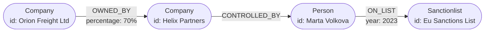
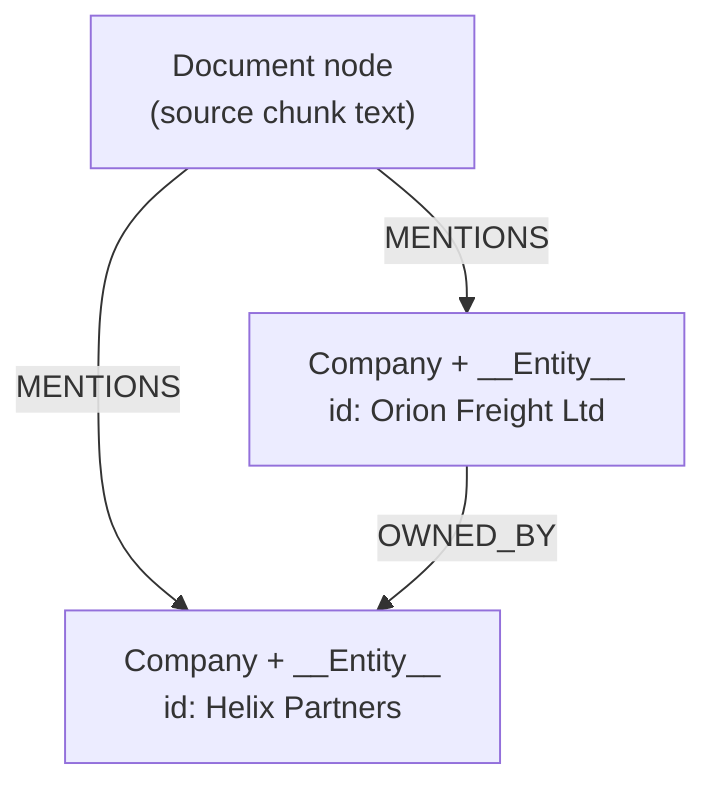

# Neo4j Notes

Neo4j is the graph database behind the [app](../app/README.md). These notes cover the model, the query language, and how this project uses both. Queries marked "verified" were run against the project's live graph (Neo4j 5.26, APOC 5.26) loaded from [long_docs.txt](../app/data/long_docs.txt).

Related: [knowledge-graph-notes.md](knowledge-graph-notes.md) (why graphs), [WORKFLOW.md](WORKFLOW.md) (app design), [llm-requirements-and-scaling.md](llm-requirements-and-scaling.md).

---

## 1. What Neo4j is

A **native graph database**: data is stored as nodes and relationships, and relationships are first-class records that point directly at the nodes they connect. Following a relationship does not require a join or an index lookup per hop, which is why multi-hop traversals stay fast as data grows. It is transactional (ACID), queried with **Cypher**, and accessed over the **Bolt** protocol (port 7687) or its web UI (port 7474).

| Relational database | Neo4j |
| --- | --- |
| Tables and rows | Labels and nodes |
| Foreign keys and join tables | Relationships stored directly |
| Joins at query time | Traversal along stored relationships |
| Fixed schema | Flexible schema, optional constraints |
| SQL | Cypher |

Good fit: ownership and control chains, fraud rings, recommendations, dependency and lineage graphs, knowledge graphs. Poor fit: heavy tabular aggregation over simple records, where a relational or columnar store is simpler.

---

## 2. The property graph model

Four building blocks:

| Element | Meaning | In this project |
| --- | --- | --- |
| Node | An entity | `Orion Freight Ltd`, `Marta Volkova` |
| Label | Type tag on a node (a node can have several) | `Company`, `Person`, `Sanctionlist`, `__Entity__` |
| Relationship | Typed, **directed** connection between two nodes | `OWNED_BY`, `CONTROLLED_BY`, `ON_LIST` |
| Property | Key-value pair on a node or relationship | `id: "Helix Partners"`, `percentage: "70%"` |



Points that trip people up:

- Every relationship has exactly one **type** and one **direction** when stored. You can still query it ignoring direction, but the stored direction carries meaning (`Acme OWNED_BY Zenith` is not `Zenith OWNED_BY Acme`).
- Relationships can have properties, which is how "owned 60%" and "listed in 2024" are stored.
- There are no mandatory schemas. Without constraints, nothing stops two nodes with the same name.

---

## 3. Cypher essentials

Cypher draws patterns in ASCII art: `()` is a node, `[]` is a relationship, `-->` is direction.

```cypher
(c:Company {id: 'Orion Freight Ltd'})-[:OWNED_BY]->(o)
```

### Reading data

| Goal | Query |
| --- | --- |
| Whole graph (small data only) | `MATCH (n)-[r]->(m) RETURN n, r, m` |
| Count nodes per label (verified: Company 9, Person 8, Sanctionlist 6, Bank 2) | `MATCH (n:__Entity__) UNWIND labels(n) AS l WITH l WHERE l <> '__Entity__' RETURN l, count(*) AS n ORDER BY n DESC` |
| Direct owner | `MATCH (c:Company {id:'Orion Freight Ltd'})-[:OWNED_BY]->(o) RETURN o.id` |
| Filter on a relationship property | `MATCH (c)-[r:OWNED_BY]->(o) WHERE r.percentage = '70%' RETURN c.id, o.id` |

### Multi-hop paths (the reason for using a graph)

```cypher
// Verified: returns Baltic Cargo -> Orion Freight -> Helix Partners -> Marta Volkova -> Eu Sanctions List
MATCH p = (c:Company {id:'Baltic Cargo Ltd'})-[:OWNED_BY|CONTROLLED_BY*1..4]->(x)-[:ON_LIST]->(l)
RETURN [n IN nodes(p) | n.id] AS chain
```

- `[:OWNED_BY|CONTROLLED_BY*1..4]` means "follow either type, between 1 and 4 hops".
- `p = ...` captures the whole path so you can return it. `nodes(p)` and `relationships(p)` unpack it.
- Always **bound** variable-length patterns (`*1..4`, not `*`). Unbounded patterns can explode on dense graphs.

### Shortest path

```cypher
// Verified: Nordhaven Metals -> Sorokin Trading -> Dmitri Sorokin (2 hops)
MATCH (a:Company {id:'Nordhaven Metals Ltd'}), (b:Person {id:'Dmitri Sorokin'})
MATCH p = shortestPath((a)-[:OWNED_BY|CONTROLLED_BY*..6]->(b))
RETURN [n IN nodes(p) | n.id] AS chain, length(p) AS hops
```

### Aggregation

```cypher
// Verified: Dmitri Sorokin -> 2 companies; Marta Volkova -> 3 companies (5 total)
MATCH (c:Company)-[:OWNED_BY|CONTROLLED_BY*1..4]->(p:Person)-[:ON_LIST]->()
RETURN p.id AS person, collect(DISTINCT c.id) AS companies
ORDER BY person
```

This is the exact-count capability plain vector RAG lacks; see [rag-vs-graph-long-docs.md](rag-vs-graph-long-docs.md).

### Writing data

| Goal | Query |
| --- | --- |
| Create (always adds a new node) | `CREATE (:Company {id:'Acme Ltd'})` |
| Merge (get or create) | `MERGE (c:Company {id:'Acme Ltd'})` |
| Merge a relationship | `MATCH (a:Company {id:'Acme Ltd'}), (b:Company {id:'Zenith Holdings'}) MERGE (a)-[:OWNED_BY]->(b)` |
| Update a property | `MATCH (c:Company {id:'Acme Ltd'}) SET c.country = 'UK'` |
| Delete a node and its relationships | `MATCH (c:Company {id:'Acme Ltd'}) DETACH DELETE c` |
| Wipe everything (what `--reset` does) | `MATCH (n) DETACH DELETE n` |

Plain `DELETE` fails if the node still has relationships; `DETACH DELETE` removes them first.

### Keywords worth knowing

| Keyword | Use |
| --- | --- |
| `WHERE` | Filter after `MATCH` |
| `WITH` | Pipe results from one part of a query into the next |
| `OPTIONAL MATCH` | Like a left join: keep the row even if no match |
| `UNWIND` | Turn a list into rows |
| `collect()` | Aggregate rows into a list |
| `UNION` | Combine result sets |
| `EXPLAIN` / `PROFILE` | Show the query plan / run it and show db hits |

---

## 4. CREATE vs MERGE (the one to get right)

`CREATE` always makes a new node. `MERGE` matches on the pattern you give and creates only if nothing matches.

```cypher
// Verified: running the MERGE twice leaves exactly one node
MERGE (n:Tmp {id:'x'})
MERGE (m:Tmp {id:'x'})
```

This is how ingestion deduplicates entities: `add_graph_documents` merges nodes on their `id`, so "Zenith Holdings" mentioned in ten chunks becomes one node. The consequence is that **matching is exact**: "Zenith Holdings" and "Zenith Holding" become two disconnected nodes. That is why entity resolution matters at scale.

---

## 5. How this project maps onto Neo4j

Written by `add_graph_documents(..., baseEntityLabel=True, include_source=True)` in [ingest.py](../app/ingest.py):



| Feature | Detail (verified) |
| --- | --- |
| Entity identity | Each entity has an `id` property holding its name |
| Shared label | Every entity also carries `__Entity__`, from `baseEntityLabel=True` |
| Uniqueness | A `UNIQUENESS` constraint on `__Entity__(id)` exists, which also gives an index on that property |
| Provenance | `Document` nodes store each source chunk and link to entities with `MENTIONS` (31 chunks to 25 entities in the current graph) |
| Label casing | Labels are normalised, so `SanctionList` in the schema appears as `Sanctionlist`. Cypher is case-sensitive for labels and types, so the query prompt must use the form in the live schema |
| Value formats | Extracted values are strings (`'70%'`, `'5 million GBP'`), not numbers |
| Name casing | The extractor title-cases some names (`Hsbc`, `Eu Sanctions List`) |

Inspect it:

```cypher
SHOW CONSTRAINTS
SHOW INDEXES
CALL db.schema.visualization()
```

The chain in [query.py](../app/query.py) reads the schema through APOC (`apoc.meta.data()`), then shows it to the LLM so it can write valid Cypher. That is why the container needs APOC (section 8).

---

## 6. Indexes and constraints

| Item | What it does | Example |
| --- | --- | --- |
| Uniqueness constraint | No two nodes of a label share a value; creates an index | `CREATE CONSTRAINT company_id IF NOT EXISTS FOR (c:Company) REQUIRE c.id IS UNIQUE` |
| Range index | Speeds exact and range lookups | `CREATE INDEX person_name IF NOT EXISTS FOR (p:Person) ON (p.id)` |
| Full-text index | Fuzzy and keyword search over text | `CREATE FULLTEXT INDEX entity_names IF NOT EXISTS FOR (n:__Entity__) ON EACH [n.id]` |
| Vector index | Similarity search over embeddings (Neo4j 5.x) | Used for hybrid GraphRAG: embed chunks and entities, then traverse from the hits |

Why bother: every query in this app starts with `MATCH (c:Company {id: '...'})`. Without an index on `id`, that is a scan of all `Company` nodes. The uniqueness constraint that ingestion creates covers it.

Use `PROFILE` to confirm an index is actually used.

---

## 7. Variable-length paths and performance

- Traversal cost grows with the number of paths, not the size of the database. A bounded pattern from one start node is cheap; the same pattern from every node can be expensive.
- Always bound the depth (`*1..4`).
- Anchor the pattern with an indexed property (`{id: '...'}`) so the search starts from one node.
- For counting reachable nodes, use `DISTINCT` (as in `count(DISTINCT c)`) so several paths to the same node are not counted twice.
- Prefer returning ids or properties over whole nodes for large results.
- Dense nodes (a bank with a million customers) are a known hazard; limit expansion or filter by relationship type and direction.

---

## 8. Ecosystem pieces

| Piece | Purpose | Note for this project |
| --- | --- | --- |
| Neo4j Browser (port 7474) | Run Cypher and view results as a graph | First stop for checking what ingestion produced |
| Bolt (port 7687) | Binary protocol drivers use | `NEO4J_URI=bolt://localhost:7687` |
| APOC | Library of procedures and functions | **Required** by `Neo4jGraph` for schema reading; installed via `NEO4J_PLUGINS: '["apoc"]'` plus `dbms.security.procedures.unrestricted` in [docker-compose.yml](../app/docker-compose.yml) |
| Graph Data Science (GDS) | Graph algorithms: centrality, community detection, similarity | Basis for GraphRAG community summaries and fraud-ring detection; not used in this app |
| Vector and full-text indexes | Hybrid retrieval | Natural next step: hybrid GraphRAG |
| Aura | Managed cloud Neo4j | An alternative to the local container |

---

## 9. Talking to Neo4j from Python

Three layers, from low to high:

| Layer | Package | Use |
| --- | --- | --- |
| Driver | `neo4j` | Run Cypher directly and read records |
| LangChain wrapper | `langchain-neo4j`: `Neo4jGraph` | `.query(cypher)`, schema introspection, `add_graph_documents()` |
| Chain | `langchain-neo4j`: `GraphCypherQAChain` | Question to Cypher to answer |

```python
from config import get_graph
g = get_graph()
g.query("MATCH (c:Company) RETURN c.id AS company LIMIT 3")   # returns a list of dicts
```

Use query parameters rather than string formatting when values come from users:

```python
g.query("MATCH (c:Company {id: $name}) RETURN c", params={"name": "Orion Freight Ltd"})
```

---

## 10. Running it locally

```bash
cd ../app
docker compose up -d            # start (data kept in the neo4j_data volume)
docker compose logs -f neo4j    # watch startup
docker compose down             # stop, keep data
docker compose down -v          # stop and DELETE the data volume
```

- Browser login: `neo4j` / `password123` (from `NEO4J_AUTH` in the compose file).
- Startup takes 20-30 seconds; connections made before that fail.
- If the password in the compose file changes after the volume was created, the old password stays. Fix with `down -v`.
- Ingestion is additive; use `ingest --reset` or `MATCH (n) DETACH DELETE n` for a clean graph.

---

## 11. Production considerations

| Topic | Guidance |
| --- | --- |
| Read-only access | The query chain runs LLM-generated Cypher with `allow_dangerous_requests=True`. Give it a **read-only** database user. Fine-grained roles and permissions are an Enterprise feature, so check what your edition supports |
| Cypher safety | Validate or restrict generated Cypher (allow only `MATCH`/`RETURN`, block `DELETE`, `SET`, `CALL` of risky procedures) |
| Credentials | Never keep real passwords in compose files or version control; use secrets |
| Backups | Use Neo4j's backup tooling; a Docker volume is not a backup |
| Editions | Community is single-instance; clustering and advanced security are Enterprise |
| Capacity | Memory (page cache) matters most for traversal speed; size it to your graph |
| APOC | `procedures.unrestricted` for `apoc.*` is convenient locally; narrow it in production |

---

## 12. Gotchas

| Gotcha | Cause | Fix |
| --- | --- | --- |
| `Could not use APOC procedures` | APOC plugin not installed or not allowed | Add the plugin and unrestricted setting to the container |
| Query returns `[]` for something that exists | Wrong label or relationship case, wrong direction, or wrong property name | Check `CALL db.schema.visualization()`; labels and types are case-sensitive |
| Duplicate-looking nodes | `MERGE` matches exactly | Normalise names, add an entity-resolution pass |
| `DELETE` fails | Node still has relationships | `DETACH DELETE` |
| Slow query | Missing index or unbounded `*` path | `PROFILE`, add an index, bound the depth |
| Counts too high | Multiple paths to the same node | `count(DISTINCT ...)` |
| Can't log in after changing password | Old password stored in the data volume | `docker compose down -v` |
| Numbers behave like strings | Extractor stored `'70%'` as text | Convert on load, or declare numeric properties in extraction |

---

## 13. Quick reference

```cypher
MATCH (n:Label {prop: 'x'}) RETURN n               -- find a node
MATCH (a)-[:REL]->(b) RETURN a, b                  -- follow one relationship
MATCH p = (a)-[:R1|R2*1..4]->(b) RETURN p          -- bounded multi-hop
MATCH p = shortestPath((a)-[*..6]->(b)) RETURN p   -- shortest path
MERGE (n:Label {id: 'x'})                          -- get or create
MATCH (n) DETACH DELETE n                          -- wipe
SHOW CONSTRAINTS / SHOW INDEXES                    -- what exists
CALL db.schema.visualization()                     -- what the graph looks like
PROFILE <query>                                    -- why it is slow
```

Official documentation: the Neo4j Cypher Manual and Operations Manual at neo4j.com/docs are the authoritative references for syntax, indexes and security.
