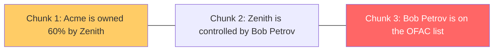

# Traditional RAG vs Knowledge Graph: same data, same questions

Code: [../rag-app/main.py](../rag-app/main.py) (RAG, its own project) and [../app/query.py](../app/query.py) (graph). Both use the same sample data (`data/sample_docs.txt` in each project) and `gpt-4o`.

The RAG setup is the standard one: one chunk per paragraph, OpenAI `text-embedding-3-small` embeddings, top-k similarity search, and an LLM told to answer only from the retrieved chunks.

Run it:

```bash
cd ../rag-app
uv run main.py --k 2        # the three failing questions
uv run main.py --k 5 "Is Acme Ltd exposed to sanctions risk?"   # retrieve everything
```

## The facts, and why they are hard for RAG



The answer to "is Acme exposed?" needs all three chunks. Chunk 3 never mentions Acme, and chunk 2 never mentions sanctions, so neither is similar to the question.

## Results (observed, top-k = 2)

| Question | Chunks retrieved | RAG answer | Graph answer |
| --- | --- | --- | --- |
| Is Acme Ltd exposed to sanctions risk? | Acme loan and manager; Acme owned by Zenith | "I don't know." | Yes: Acme, owned by Zenith, controlled by Bob Petrov, on the OFAC list |
| Who is the ultimate owner of Acme Ltd? | Acme owned by Zenith; Acme loan and manager | "I don't know." | Follows `OWNED_BY` / `CONTROLLED_BY` up the chain |
| How many companies are owned by a sanctioned person? | Bob on OFAC list; Zenith controlled by Bob | "I don't know." | 2 |

The retriever did what it is built to do: it returned the chunks most similar to the words in the question. Both Acme chunks outrank the Zenith and Bob chunks for the first two questions, because only they contain "Acme Ltd". The missing link is a relationship, and similarity search cannot follow relationships.

## What this does and does not show

- **The failure here is an honest "I don't know".** The prompt tells the model to refuse when the context is insufficient, which is the good outcome. Without that instruction, or with a model that fills gaps from general knowledge, the same retrieval gap can produce a confident wrong answer. Nothing in the pipeline would flag it.
- **With `--k 5` RAG answers correctly**, because five chunks is the whole file. That is not a fix, it is the toy-data trap: at 5 paragraphs you can retrieve everything. With thousands of documents, the three linked chunks are scattered among many near-duplicates about Acme, and no practical `k` reliably contains all of them. Raising `k` also adds cost and noise.
- **The counting question is the clearest case.** It needs an aggregate over every company in the corpus. Top-k retrieval only ever sees a handful of chunks, so it can never count reliably, however good the embeddings are.
- **The graph's advantage is not cleverer language, it is structure.** The extractor turned the sentences into edges once, at ingest time, and the query follows `OWNED_BY|CONTROLLED_BY*1..4` edges directly. The printed Cypher shows exactly why the answer was given.

## When plain RAG is still the right tool

If the answer lives inside one passage, such as "what is the leave policy", RAG is simpler and cheaper, and needs no graph build step. Use the graph when answers depend on connections between entities, or on counting and aggregation. See [knowledge-graph-notes.md](knowledge-graph-notes.md) for the full list of scenarios.
