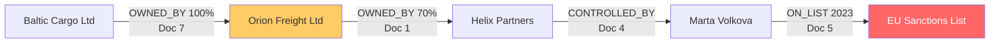

# Vector RAG vs Knowledge Graph on a realistic corpus

The five-paragraph example in [rag-vs-graph-demo.md](rag-vs-graph-demo.md) is a toy: with five chunks, retrieval can almost always grab everything. This run uses a larger, noisier corpus so the retrieval problem is realistic.

- **Data:** [app/data/long_docs.txt](../app/data/long_docs.txt) (copy in [rag-app/data/](../rag-app/data/long_docs.txt)): 14 long documents, about 2,100 words. Company profiles, news, press releases, a KYC file and a compliance report.
- **Same chunking for both:** 500-character chunks with 50 overlap, giving 38 chunks.
- **RAG:** [rag-app](../rag-app/main.py), OpenAI embeddings, top-4 retrieval, `gpt-4o`.
- **Graph:** [app](../app/README.md), same chunks extracted into Neo4j (61 nodes including source documents, 23 relationships), `gpt-4o`.

## Why this corpus is hard for vector RAG

The risk story is spread over four documents, and none of the linking facts mention sanctions in the question's words:



A second chain (Nordhaven Metals, owned 80% by Sorokin Trading, owned 100% by Dmitri Sorokin, on the OFAC list) adds to the count. Ground truth for the aggregation question: **5 exposed companies** (Helix Partners, Orion Freight, Baltic Cargo, Sorokin Trading, Nordhaven Metals).

The corpus also contains decoys that real document sets always have: a compliance report about Orion's *customer screening* that says "no breaches" and is full of the word "sanctions", a news piece on trade sanctions and freight rates, and clean companies (Kestrel, Pennine) with similar descriptions.

## Results

| Question | Vector RAG, strict prompt | Vector RAG, permissive prompt | Knowledge graph |
| --- | --- | --- | --- |
| Is Orion Freight Ltd exposed to sanctions risk? | "I don't know." | Confident and misleading: describes a "robust sanctions screening programme", says risk is "well managed" | Yes: reached the EU sanctions list through Helix Partners and Marta Volkova |
| How many companies are owned or controlled, directly or indirectly, by sanctioned persons? | "I don't know." | "The documents do not provide a specific number." | 5 (correct) |
| Who is the relationship manager for Orion Freight Ltd? | Tom Becker (correct) | Tom Becker (correct) | Tom Becker (correct) |

Run them yourself:

```bash
cd ../rag-app
uv run main.py --long                 # strict prompt
uv run main.py --long --permissive    # typical "helpful assistant" prompt

cd ../app
uv run main.py ingest --path data/long_docs.txt --reset
uv run main.py ask "Is Orion Freight Ltd exposed to sanctions risk?"
```

## What happened

**Question 1.** The four retrieved chunks were the compliance report (twice), the rest of that report's text, and the freight-rates news. They were the closest matches to "Orion Freight", "exposed" and "sanctions". The chunks that hold the answer were never retrieved: the ownership by Helix Partners (about the company, not sanctions), Helix's controller Marta Volkova (about Helix), and her listing (about her, not Orion). Each is only one step from the question, and similarity search cannot take steps. With a refusal-friendly prompt the model correctly says it does not know. With a permissive prompt it summarises the decoy report and gives a **reassuring answer that is the opposite of the truth**, which is the dangerous failure for a bank.

**Question 2.** Counting needs every company on every chain. Top-4 retrieval returned generic sanctions commentary (the news article and the two press releases), none of which lists a company. No value of `k` reliably fixes this, because the number of relevant chunks grows with the data.

**Question 3.** A single-passage lookup. Vector RAG handles it fine, and the report keeps this row in on purpose: the argument is not that RAG is bad, it is that it cannot do relationship questions.

## Honest caveats on the graph side

- **Extraction is not perfect.** The graph has some noise: a stray `Banking Relationship` node, `Kestrel Logistics Ltd MANAGED_BY Elena Marchetti` (she manages it as MD, a loose use of the relationship type), and no manager recorded for Pennine Foods. None of this affected the three questions, but a production system needs extraction evaluation and entity resolution.
- **The explanation in answer 1 is imprecise.** The graph answer says Orion "is listed on the EU Sanctions List". The truth is that its owner's controller is. The Cypher returned only the company and list columns, so the answering step lost the intermediate people. The yes/no is right; the printed Cypher and the graph itself hold the correct path. Returning the path in the query would fix the wording.
- **Ingest costs more.** The 38 chunks took about 55 seconds of LLM extraction calls here, compared with a one-off embedding call for RAG. That cost is paid once per document set, not per question.
- **The test is small.** It is one corpus and a handful of questions, enough to show the mechanism, not a benchmark.
