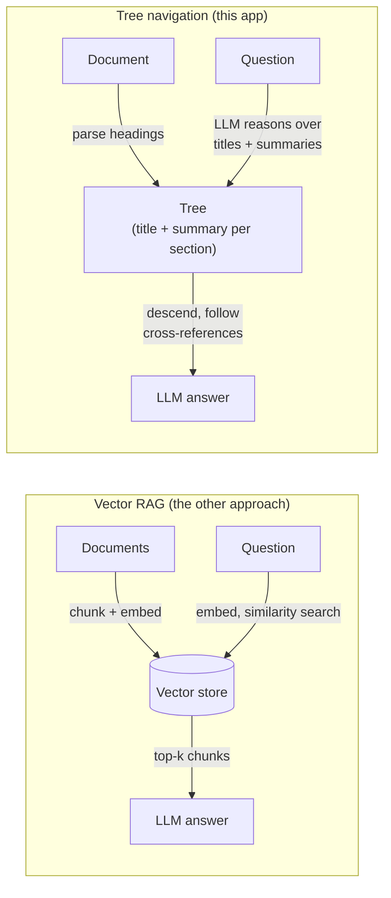

# Step 0 — Overview and Concepts

> [Back to index](README.md) · Next: [Environment Setup](02-environment-setup.md)

## Goal

Build a mental model of tree-navigation retrieval — how it differs from embedding-and-similarity-search, and why an LLM reasoning over a table of contents can do things a vector index structurally cannot — before writing a single line.

## Why this matters

Every RAG app answers questions by grounding an LLM's reply in a small set of local documents instead of relying purely on what the model memorized during training. The usual way to do that is: chunk the documents, embed each chunk, and at query time retrieve the chunks whose embeddings are closest to the question's embedding. That's what [../../rag-with-LlamaIndex/simple-rag-example](../../rag-with-LlamaIndex/simple-rag-example/README.md) does.

This app answers the same *kind* of question a different way:

Walking through the tree-navigation side:

1. **Parse** the document's own heading structure (`#`, `##`, `###`) into a tree — no fixed-size chunking, no overlap window.
2. **Summarize** each section once, bottom-up, with an LLM — a one-time index-build cost, comparable to embedding but producing short text instead of vectors.
3. At query time, show the LLM only **titles and summaries** at the current level and ask which child to descend into — repeating until it reaches a section worth reading in full.
4. If that section's text references another ("see Appendix A"), **follow the reference** explicitly instead of hoping a similarity search happens to retrieve both.
5. **Answer** using only the section(s) actually retrieved this way, citing which ones were used.

If you want the deeper "why" behind this technique — including where it wins and where a real vector store still wins — read [../vectorless-rag.md](../vectorless-rag.md) and [../pageindex-notes.md](../pageindex-notes.md) first; this walkthrough covers only what's needed to build the code.

## Why this app has no vector store at all

A vector index answers "what text looks like the question?" via cosine similarity over embeddings. That's a good proxy for relevance most of the time, but it has two specific weaknesses this app's example document is built to expose:

- **Cross-references are invisible to embeddings.** The sentence "see Appendix A" has no vector relationship to Appendix A's actual content — a similarity search only finds it if both pieces of text happen to score close enough to the question to land in the same top-k, which is never guaranteed and gets less likely as a document grows.
- **Chunking can separate a clause from the heading that gives it meaning.** A fixed-size chunk boundary doesn't know or care where one policy ends and another begins.

Tree navigation sidesteps both: sections are never split mid-thought (they're exactly the document's own headings), and a cross-reference is just a regular-expression match on the retrieved text, followed deterministically.

## Vocabulary you'll need

| Term | Meaning in this app |
| --- | --- |
| `Node` | One section of the document — a title, an LLM-written summary, its own text, and child sections |
| Tree index | The whole document represented as nested `Node`s, built once |
| Navigation | The LLM picking which child `Node` to descend into, one level at a time |
| Cross-reference | A "see Appendix X" mention in a section's text, followed automatically |
| Grounding | Answering only from the section text actually retrieved, not from the model's own memorized knowledge |

## What "done" looks like

By the end of this walkthrough, running `uv run main.py` will ask three questions about a small company handbook and, for each one, print the exact path the LLM navigated (e.g. `Company Handbook / Remote Work Policy / -> Appendix A: Team Exceptions`) followed by an answer grounded in the section(s) on that path — with zero embeddings, zero vector stores, and zero third-party dependencies.

Next: **[Environment Setup](02-environment-setup.md)** — get Ollama running and the project scaffolded so there's something to build on.
