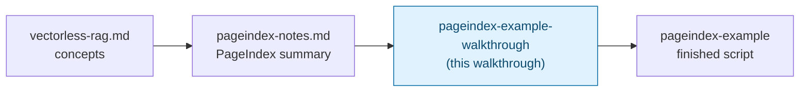

# Vectorless RAG (PageIndex-style) — Trainer Walkthrough

> A step-by-step build guide for [../pageindex-example](../pageindex-example/README.md). Follow it live in a workshop, or work through it solo — by the end you will have hand-built a tree-navigating, vectorless RAG pipeline and understand every line of it, instead of having copy-pasted a finished script.

## What you'll build

Starting from an empty folder, you will incrementally build `main.py`: a script that answers questions about a small company handbook by having a local LLM **navigate a hierarchical tree of sections** — descending from title to sub-title based on short summaries, and following "see Appendix X" cross-references — instead of embedding the document and running a similarity search. There is no vector store, no chunking, and no embedding model anywhere in this app.

Both the navigation and the final answer are generated by a local LLM through [Ollama](https://ollama.com), so no API key is involved anywhere.

## Who this is for

- **Instructors** demonstrating, live, how retrieval driven by LLM reasoning over document structure differs from retrieval driven by vector similarity.
- **Trainees** typing the code themselves, one capability at a time, rather than reading a finished file top to bottom.

## Prerequisites

- Comfortable with basic Python: functions, dataclasses, `for`/`while` loops, regular expressions at a "I can read one" level.
- [`uv`](https://docs.astral.sh/uv/) installed.
- [Ollama](https://ollama.com) installed and reachable at `http://localhost:11434` (covered in [Step 1](02-environment-setup.md); if you've already set this up for [../../rag-with-LlamaIndex/simple-rag-example](../../rag-with-LlamaIndex/simple-rag-example/README.md), you're already done — this app reuses the same `llama3:8b` model and needs no separate embedding model at all).
- No prior RAG or LlamaIndex experience assumed. For the concepts behind *why* this approach works, see [../vectorless-rag.md](../vectorless-rag.md) and [../pageindex-notes.md](../pageindex-notes.md) — this walkthrough explains what's needed inline as you build.
- About 60–75 minutes end to end.

## How this walkthrough is organized

Each step adds exactly one capability and explains **why** it's needed before showing **how** to add it. Several steps intentionally build a naive version first and let you watch it fail before fixing it — the failure is the lesson, not a distraction from it. Every step ends with a **Checkpoint**: the complete file as it should look at that point, so nobody falls out of sync with the group.

| Step | File | What you'll add | Est. time |
| --- | --- | --- | --- |
| 0 | [01-overview-and-concepts.md](01-overview-and-concepts.md) | Mental model: tree navigation vs. vector similarity | 10 min |
| 1 | [02-environment-setup.md](02-environment-setup.md) | Ollama pulled, project scaffolded, sample handbook written | 10 min |
| 2 | [03-building-the-tree.md](03-building-the-tree.md) | `Node`, `parse_markdown_tree` — heading structure as a tree, no chunking | 10 min |
| 3 | [04-talking-to-ollama.md](04-talking-to-ollama.md) | `ollama_chat` — one raw HTTP call, smoke-tested in isolation | 5 min |
| 4 | [05-summarizing-sections.md](05-summarizing-sections.md) | `summarize_tree` — the one-time, bottom-up index-build cost | 10 min |
| 5 | [06-llm-navigation-decision.md](06-llm-navigation-decision.md) | `llm_choose` — the LLM picks a child by id; watch a real matching bug, then fix it | 10 min |
| 6 | [07-the-navigation-loop.md](07-the-navigation-loop.md) | `navigate` — descend one level per turn, then follow cross-references | 10 min |
| 7 | [08-grounded-answers-and-wiring.md](08-grounded-answers-and-wiring.md) | `answer`, `main` — generate the grounded reply and run all three questions | 10 min |
| 8 | [09-recap-and-exercises.md](09-recap-and-exercises.md) | Quick-reference card, gotchas, exercises | 10 min |

## Relationship to the reference implementation

The finished code you arrive at matches [../pageindex-example/main.py](../pageindex-example/main.py) exactly by the end of Step 7. This walkthrough sequences the *build order* differently from a top-to-bottom read of the finished file (tree parsing before LLM calls, a naive id-matching scheme before the fix, navigation before answering) because that's a better teaching order — not because the underlying app is different. This skill's verification process confirmed each Checkpoint compiles and the final one matches the real source.

## Suggested demo flow (for instructors)

- Live-type each step rather than pasting — trainees follow typos and fixes better than a perfect paste.
- Step 2's naive tree parser produces a real, visible bug: an extra `Document` wrapper node around `Company Handbook`. Run it and let trainees see the duplicate level in the printed tree before explaining the one-line fix — the "aha" lands harder after seeing the wrong output.
- Step 5 is the centerpiece demo of this whole walkthrough: the LLM is asked to reply with a bare id like `4`, and llama3:8b instead echoes back `4 | Onboarding | ...`. Run the naive version live and show the raw, unparsed model output — this is the single clearest illustration in the entire series of why you can never fully trust an LLM to follow a "reply with ONLY X" instruction to the letter.
- Because every navigation and answer call goes to a live LLM, exact wording in "Try it" transcripts will differ between runs and between machines. What should stay stable is the **structure**: which `Path:` a question resolves to, and whether the answer is grounded in real section text. Tell trainees this up front so a differently-worded (but still correct) answer doesn't feel like something went wrong.
- Step 8's exercises work well as a 10–15 minute independent lab if you're running a longer session.

## Where this fits in the series

[../pageindex-example/README.md](../pageindex-example/README.md) also compares this app directly against [../../rag-with-LlamaIndex/simple-rag-example](../../rag-with-LlamaIndex/simple-rag-example/README.md) — the same questions, over the same policy/onboarding domain, answered by a vector-similarity pipeline instead. Building both is the fastest way to feel the difference between the two retrieval strategies rather than just reading about it.

Start here: **[01-overview-and-concepts.md](01-overview-and-concepts.md)**.
