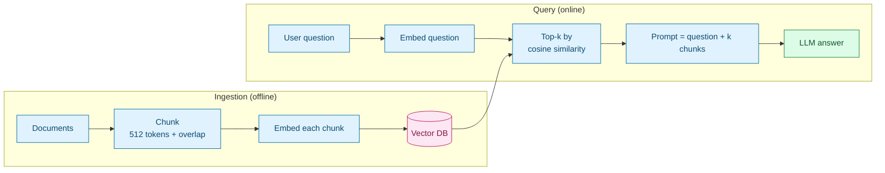
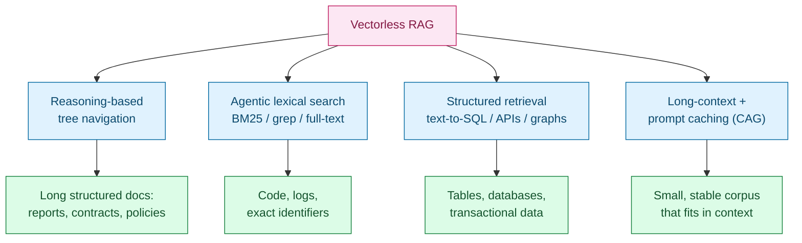
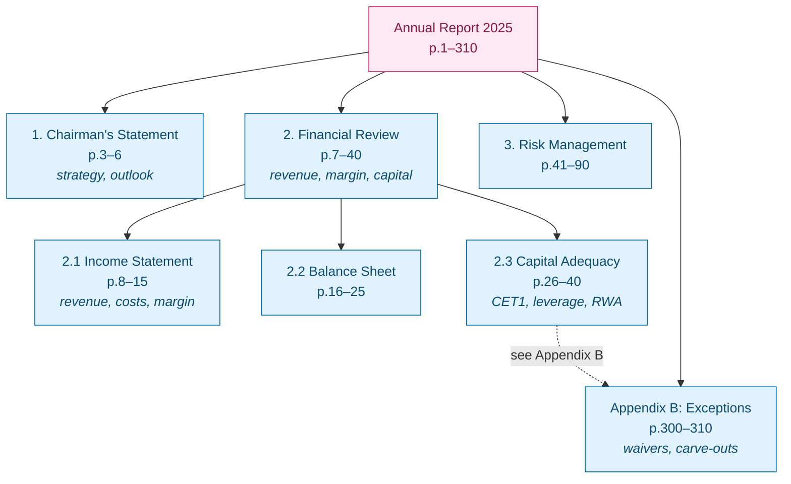
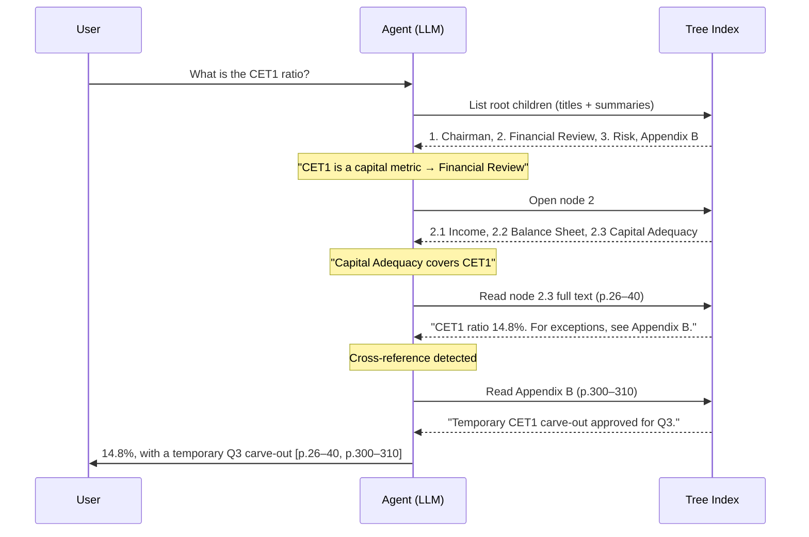
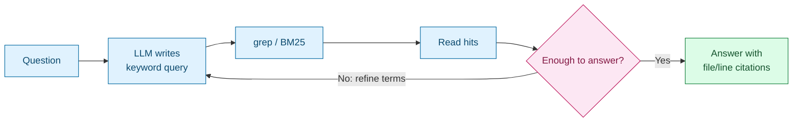
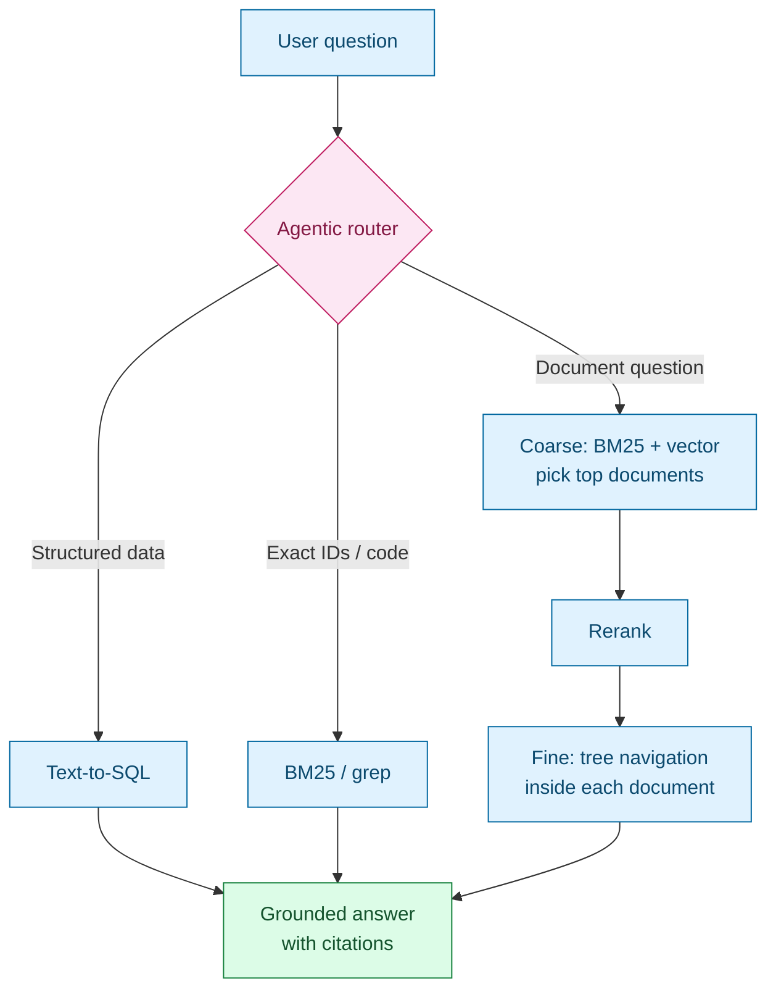
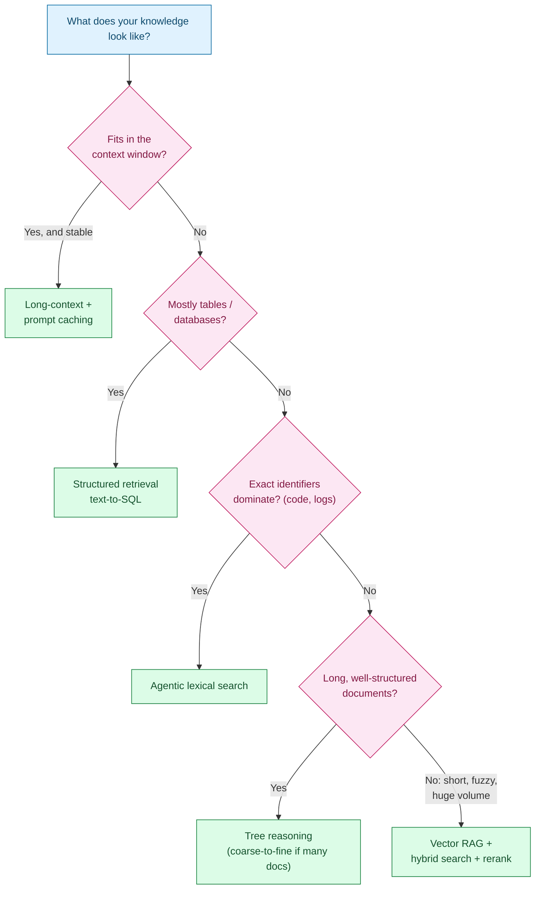

# Vectorless RAG — Retrieval by Reasoning Instead of Similarity

> Part N of the RAG series (Weeks 3–4). Earlier notes built the classic pipeline: chunk, embed, store in a vector database, retrieve top-k by cosine similarity. This note covers **vectorless RAG** — retrieval that does not depend on embedding similarity — how it works, where it beats vector search, where it loses, and how the two combine. It also sets up Week 5 (Agentic RAG), since most vectorless approaches are an agent deciding *where to look*.

## 1. Recap — How Classic Vector RAG Works

Vector RAG has two phases. Ingestion runs once per document; querying runs on every question.



The core assumption: **semantic similarity is a good proxy for relevance.** That assumption often holds — and fails in ways that matter most for long, professional documents.

## 2. Where Vector RAG Struggles

Picture a 300-page annual report or a regulatory policy manual.

| Failure mode | What happens | Example |
| --- | --- | --- |
| Chunking destroys structure | A clause loses the heading that gave it meaning; tables split across chunks | "The limit shall not exceed 15%" — which limit? Section 4.2's heading is in another chunk |
| Similar is not relevant | Chunks that *discuss* the topic outrank the chunk that *answers* it | "Change in operating margin FY24 → FY25" returns commentary on margins, not the table |
| Exact tokens blur | IDs, codes, and figures embed poorly | Policy `AML-POL-0423` vs `AML-POL-0432` look nearly identical as vectors |
| Cross-references invisible | "See Appendix B" has no vector relationship to Appendix B | The exception that changes the answer is never retrieved |
| Opaque retrieval | You only get a score | "Why did it pick this chunk?" — "similarity 0.81" |
| Infra overhead | Embedding model, vector store, re-indexing on every change | Changing chunk size means re-embedding the entire corpus |

> **Gotcha:** Increasing `k` is the usual reflex when retrieval misses. It adds noise and tokens, and it still cannot follow a cross-reference or reassemble a split table. The problem is the retrieval *method*, not the retrieval *count*.

## 3. What "Vectorless RAG" Means

Vectorless RAG is an umbrella term: **generation is still grounded in retrieved content, but the content is found without embedding similarity.** Four main flavors:



When people say "vectorless RAG" today, they usually mean the first one (popularized by PageIndex). The next two sections cover it in depth; [§6](#6-the-other-three-flavors) covers the rest.

## 4. The Tree Index — Replacing Chunks with Structure

Instead of chunking, the document is turned into a **hierarchical index** — an enhanced table of contents. Each node holds a title, a short LLM-generated summary, and a page range. The full text stays attached to leaf nodes and is only read when the node is opened.



Building the index is a one-time LLM cost per document: parse the heading structure (from PDF outlines, heading styles, or an LLM pass), then summarize each node bottom-up. The result is typically a JSON tree — no vector store needed.

## 5. Query Time — Navigating Like an Analyst

At query time the LLM sees **titles and summaries only**, reasons about which branch holds the answer, opens it, and repeats until it reaches a section worth reading. If that section references another ("see Appendix B"), it follows the reference.



### A runnable sketch

The code below replaces the LLM with a word-overlap scorer so it runs with no API key. The *shape* — descend one level per reasoning step, then follow cross-references — is exactly what a real implementation does; only `mock_llm_choose` changes.

```python
import re
from dataclasses import dataclass, field


@dataclass
class Node:
    id: str
    title: str
    summary: str
    pages: tuple[int, int]
    text: str = ""
    children: list["Node"] = field(default_factory=list)


tree = Node("0", "Annual Report 2025", "full report", (1, 310), children=[
    Node("1", "Chairman's Statement", "strategy outlook priorities", (3, 6)),
    Node("2", "Financial Review", "revenue margin cet1 ratio capital", (7, 40), children=[
        Node("2.1", "Income Statement", "revenue operating costs margin", (8, 15),
             text="Operating margin: FY24 18.2%, FY25 21.4%."),
        Node("2.3", "Capital Adequacy", "cet1 leverage ratio rwa", (26, 40),
             text="CET1 ratio 14.8%. For exceptions, see Appendix B."),
    ]),
    Node("B", "Appendix B", "exceptions waivers carve-outs", (300, 310),
         text="Temporary CET1 carve-out approved for Q3."),
])


def mock_llm_choose(question, children):
    """Stand-in for the LLM: pick the child whose title+summary overlaps the question most."""
    q = set(re.findall(r"\w+", question.lower()))
    scored = [(len(q & set(re.findall(r"\w+", f"{c.title} {c.summary}".lower()))), c)
              for c in children]
    score, best = max(scored, key=lambda s: s[0])
    return best if score > 0 else None


def find_by_title(root, title):
    if root.title == title:
        return root
    for c in root.children:
        if (hit := find_by_title(c, title)):
            return hit
    return None


def navigate(question, root):
    path, node = [root.title], root
    while node.children:                       # descend the tree, one reasoning step per level
        nxt = mock_llm_choose(question, node.children)
        if nxt is None:
            break
        node = nxt
        path.append(node.title)
    context = [(node.title, node.pages, node.text)]
    for ref in re.findall(r"see (Appendix \w)", node.text):   # follow cross-references
        target = find_by_title(root, ref)
        path.append(f"-> {target.title}")
        context.append((target.title, target.pages, target.text))
    return path, context


path, ctx = navigate("What was the operating margin?", tree)
print(" / ".join(path))
# Annual Report 2025 / Financial Review / Income Statement
print(ctx)
# [('Income Statement', (8, 15), 'Operating margin: FY24 18.2%, FY25 21.4%.')]

path, ctx = navigate("What is the CET1 ratio?", tree)
print(" / ".join(path))
# Annual Report 2025 / Financial Review / Capital Adequacy / -> Appendix B
for title, pages, text in ctx:
    print(f"{title} p.{pages[0]}-{pages[1]}: {text}")
# Capital Adequacy p.26-40: CET1 ratio 14.8%. For exceptions, see Appendix B.
# Appendix B p.300-310: Temporary CET1 carve-out approved for Q3.
```

Swapping in a real LLM means replacing `mock_llm_choose` with a prompt like:

```python
prompt = f"""Question: {question}
You are navigating a document's table of contents.
Options (id | title | summary):
{chr(10).join(f"{c.id} | {c.title} | {c.summary}" for c in children)}
Reply with the single id most likely to contain the answer, or NONE."""
```

> **Gotcha:** The mock scorer is greedy and never backtracks. A real implementation should let the LLM say "this branch was wrong, go back" — early wrong turns are the main failure mode of tree navigation (see [§8](#8-trade-offs--where-vectorless-loses)).

## 6. The Other Three Flavors

### 6.1 Agentic lexical search

The LLM drives keyword tools — BM25, Elasticsearch, `grep`, SQL `LIKE` — and iterates: search, read, refine the query, search again. Coding agents such as Claude Code navigate repositories this way (grep, glob, file reads) rather than with an embedding index, because in code the **exact identifier** matters far more than semantic closeness.



### 6.2 Structured retrieval

When knowledge lives in tables, "retrieval" becomes a query: text-to-SQL, a REST/GraphQL call, or a knowledge-graph traversal. "Top 5 customers by overdue balance" is a `SELECT ... ORDER BY ... LIMIT 5`, not a similarity search over text dumps of the table.

### 6.3 Long-context + prompt caching (CAG)

If the corpus fits in the context window, skip retrieval entirely. Load it once as a cached prompt prefix; each query pays only for the new tokens. Best for a bounded, stable corpus — one product manual, one policy set.

## 7. Side-by-Side Comparison

| Aspect | Vector RAG | Vectorless (tree reasoning) |
| --- | --- | --- |
| Unit of retrieval | Fixed-size chunks | Natural sections (chapters, clauses, tables) |
| How relevance is decided | Cosine similarity of embeddings | LLM reasoning over structure + summaries |
| Document structure | Mostly lost at chunking | Preserved and used |
| Exact terms (IDs, codes, figures) | Weak | Strong (especially with lexical tools) |
| Cross-references / multi-hop | Poor | Natural — follow "see Appendix B" |
| Explainability | A similarity score | A readable path: "opened 2 → 2.3 because the question is about CET1" |
| Infrastructure | Embedding model + vector DB | JSON tree + LLM |
| Query latency / cost | Low (one embed + ANN lookup) | Higher (several LLM calls per query) |
| Scale sweet spot | Millions of short, loosely structured docs | Fewer, long, well-structured docs |

### Advantages in short

1. **Accuracy on long structured documents** — filings, contracts, regulatory manuals, specs are written with deliberate hierarchy; vectorless retrieval uses it instead of discarding it.
2. **Traceability** — every retrieval step is a readable decision with section and page references. In a regulated environment (banking model-risk review, audit), that is something a reviewer can actually assess. This connects directly to Week 6 (evaluation) and Week 7 (governance).
3. **No chunk/embedding tuning** — no chunk size, overlap, embedding model choice, or re-indexing cycle.
4. **Precise and multi-part questions** — "compare X in §2 with the exception in Appendix B" becomes navigation, not hoping both chunks land in top-k.
5. **Simpler infra** — no separate vector store to operate, secure, and keep in sync.

## 8. Trade-offs — Where Vectorless Loses

| Trade-off | Why it matters |
| --- | --- |
| Latency and cost | 3–6 LLM calls per query vs a millisecond vector lookup — adds up fast for a high-traffic chatbot |
| Scale | Tree navigation works inside one long doc or a modest collection; it cannot scan 10 million support tickets |
| Needs structure | Chat logs, scraped pages, short FAQs have no meaningful hierarchy to navigate |
| Wrong turns compound | A bad choice near the root can miss the answer entirely — node summary quality and backtracking matter |
| Index build cost | Summarizing every node is an upfront LLM cost (once per document) |

> **Gotcha:** Vector search is genuinely better at **fuzzy semantic matching on unstructured text** — mapping "the ATM swallowed my card" to an article titled "Card retention procedure". Don't throw it away; decide where each method fits.

## 9. The Practical Answer — Hybrid Architectures

Most production systems combine methods. The most common pattern is **coarse-to-fine**: a fast index narrows a large corpus to a few documents, then tree reasoning finds the exact section within each.



Three hybrid patterns worth knowing:

- **Coarse-to-fine** — vector/BM25 selects documents; tree reasoning selects sections.
- **Hybrid search + reranking** — run BM25 and vector in parallel, merge (e.g. reciprocal rank fusion), rerank with a cross-encoder or LLM. Fixes the exact-term weakness without abandoning embeddings.
- **Agentic routing** — an agent chooses SQL, keyword, vector, or tree navigation per question. This is Agentic RAG — the Week 5 topic.

## 10. Choosing an Approach



> **One-line mental model:** vector RAG asks *"what text looks like the question?"* Vectorless RAG asks *"where would an expert look to answer this question?"* The first is fast and scales broadly; the second is slower but closer to how humans actually research — which is why it wins where precision matters.

## Quick Reference Card

| Situation | Approach | Key mechanism |
| --- | --- | --- |
| Long structured docs; precision and audit matter | Tree reasoning | LLM navigates ToC-style index, follows cross-refs |
| Codebase, logs, policy/error IDs | Agentic lexical search | Iterative grep / BM25 with query refinement |
| Tables, transactional data | Structured retrieval | Text-to-SQL, API calls, graph queries |
| Small stable corpus | Long-context (CAG) | Whole corpus as cached prompt prefix |
| Huge volume of short, fuzzy text | Vector RAG | Embeddings + ANN top-k |
| Mixed enterprise knowledge | Hybrid | Router + coarse-to-fine + rerank |
| Retrieval misses a split table or appendix | Don't just raise `k` | Switch to structure-aware retrieval |

## What's Next in This Series

1. **Hybrid search and reranking** — BM25 + vector with reciprocal rank fusion and cross-encoder rerankers.
2. **Building a tree index from real PDFs** — extracting outlines, summarizing nodes bottom-up, persisting as JSON.
3. **Agentic RAG (Week 5)** — routing between retrieval tools, backtracking, and multi-step retrieval plans.
4. **Evaluating retrieval (Week 6)** — measuring retrieval precision, answer faithfulness, and citation correctness across vector vs vectorless pipelines.
